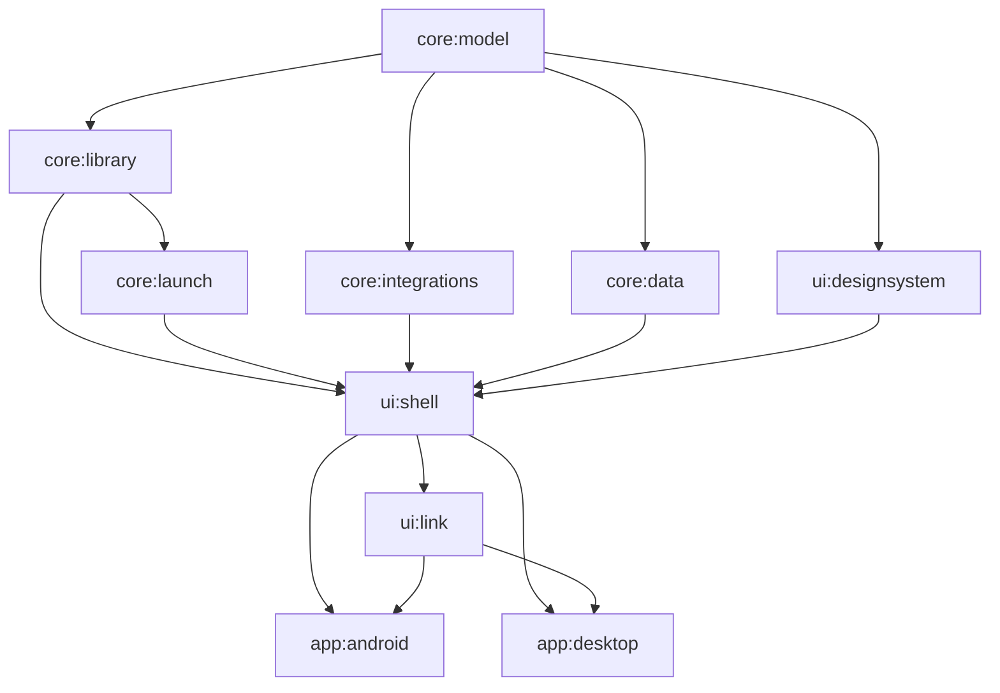

# Architecture

Fuse is a Kotlin Multiplatform project. Everything that can be shared (the domain model, library
scanning, launch resolution, provider clients, the database and the whole interface) is common code
that runs on Android and on the desktop JVM. The two apps only supply what the operating system owns:
file access, secure storage, starting other programs, system status and input devices.

Paths below are relative to the module's `src/commonMain/kotlin/io/github/matiyaaa/fuse/...` unless
they start at the repository root.

## Contents

- [Module graph](#module-graph)
- [Module responsibilities](#module-responsibilities)
- [Domain concepts](#domain-concepts)
- [Scanning pipeline](#scanning-pipeline)
- [Folder policies](#folder-policies)
- [Multi-disc games and playlists](#multi-disc-games-and-playlists)
- [Launch resolution](#launch-resolution)
- [Input routing](#input-routing)
- [Selection models](#selection-models)
- [FuseStore and FuseServices](#fusestore-and-fuseservices)
- [Database and migrations](#database-and-migrations)
- [Security model](#security-model)
- [Threading](#threading)

## Module graph

Read an arrow as "is used by". Dependencies only point down: `core:*` modules know nothing about
Compose, `ui:designsystem` knows nothing about the library or launching, and nothing below the apps
knows which operating system it runs on. The graph is enforced by the `build.gradle.kts` of each
module; `settings.gradle.kts` lists the nine modules. The two app modules depend on `ui:shell` and
implement its `FuseServices` and `PlatformUi` contracts.

Build conventions live in `build-logic/` as precompiled script plugins:

| Plugin | Applied to | What it sets up |
|---|---|---|
| `fuse.kmp.library` | every `core:*` and `ui:*` module | Kotlin Multiplatform with an Android target (AGP 9 KMP library plugin) and a desktop JVM target named `desktop`, JVM 17, coroutines, `kotlin("test")` for `commonTest` |
| `fuse.kmp.compose` | `ui:designsystem`, `ui:shell` | Compose Multiplatform runtime, foundation, UI, animation and resources on top of the above |
| `fuse.serialization`, `fuse.sqldelight` | modules that need them | kotlinx.serialization and SQLDelight plugins |
| `fuse.android.application` | `app:android` | Application id `io.github.matiyaaa.fuse`, compile/target/min SDK from the version catalog, `versionName` and `versionCode` from `gradle.properties` |
| `fuse.desktop.application` | `app:desktop` | Kotlin JVM with Compose Desktop, JVM 17 |

Namespaces follow the module path (`io.github.matiyaaa.fuse.core.model` for `:core:model`).

## Module responsibilities

| Module | Responsibility | Key entry points |
|---|---|---|
| `core:model` | Serializable domain types shared by every layer. No logic beyond small derived properties | `Game.kt`, `Platform.kt`, `Launch.kt`, `Media.kt`, `Settings.kt` |
| `core:library` | Reads library folders and turns them into `ScannedGame`s: platform detection, folder interpretation, disc grouping, filename parsing, local media, BIOS checks. Read-only | `scan/LibraryScanner.kt`, `scan/FolderInterpreter.kt`, `PlatformCatalog.kt`, `bios/BiosChecker.kt` |
| `core:launch` | Emulator and launcher catalogs as data, installed-emulator detection helpers, and launch resolution into a `LaunchPlan`. Never starts anything | `LaunchResolver.kt`, `AdapterRegistry.kt`, `android/AndroidEmulatorCatalog.kt`, `linux/LinuxCatalog.kt`, `desktop/WindowsCatalog.kt`, `desktop/MacCatalog.kt` |
| `core:integrations` | HTTP clients for RetroAchievements, SteamGridDB, IGDB, TheGamesDB, ScreenScraper, libretro thumbnails, the Art Book Next system art pack and GitHub Releases; the scrape coordinator and title matcher; the Cartridge bridge protocol | `scrape/ScrapeCoordinator.kt`, `cartridge/CartridgeProtocol.kt`, `FuseHttp.kt` |
| `core:data` | SQLDelight database, repositories, the library indexer that reconciles scans, app settings and scoped settings, the `SecretStore` contract | `FuseData.kt`, `repo/LibraryIndexer.kt`, `settings/AppSettings.kt` |
| `ui:designsystem` | Tokens, colours, typography, shapes, motion, theme presets, focus and selection, input routing, components, icons, sounds, hero backdrop and generated art | `theme/`, `components/`, `input/InputRouter.kt` |
| `ui:shell` | Every screen and overlay, navigation, onboarding and settings, written against the `FuseStore` and `PlatformUi` interfaces | `app/FuseApp.kt`, `store/FuseStore.kt`, `store/FuseServices.kt` |
| `ui:link` | Phone Link: a small Ktor (CIO) web server with its JSON and live-updates API over `FuseStore`, sign-in (PBKDF2 password hash, sessions, lockout) and the phone web app in `src/web`, bundled into `WebAssets.kt` at build time. See [docs/PHONE_LINK.md](docs/PHONE_LINK.md) | `PhoneLinkServer.kt`, `LinkApi.kt`, `LinkAuth.kt`, `src/web/` |
| `app:android` | Android host: implements `FuseServices` and `PlatformUi` (Home role, emulator launching, status data, Cartridge provider client, installer, companion screen, Keystore secrets) | `app/android/src/main` |
| `app:desktop` | Linux, Windows and macOS host, switching on `DesktopOs` where they differ: implements `FuseServices` and `PlatformUi` (window modes, controllers from `/dev/input` or SDL, Secret Service, DPAPI or Keychain secrets, AppImage, MSI and DMG packaging). No Apps section on any desktop; Cartridge only on Linux | `app/desktop/src/main` |

## Domain concepts

| Concept | Type in code | File |
|---|---|---|
| Game | `Game`, `GameTitles`, `ChildContent`, `Disc`, `FilenameTags`, `GameMetadata`, `PlayStats`, `ExternalLinks` | `core/model/.../model/Game.kt` |
| Platform | `Platform`, `PlatformSummary`, `EmulatorAvailability`; the catalog of 69 platforms | `core/model/.../model/Platform.kt`, `core/library/.../library/PlatformCatalog.kt`, `core/library/.../library/platform/CatalogPlatforms.kt` |
| LibrarySource | `LibrarySource`, `LibrarySourceKind` (`ROMS_ROOT`, `ROMM_LIBRARY`, `PLATFORM_FOLDER`, `SHORTCUTS`) | `core/model/.../model/Library.kt` |
| GameLocation | `GameLocation`, `LocationKind`, `FolderInterpretation` | `core/model/.../model/Game.kt` |
| FolderPolicy | `FolderPolicy`; resolved by `FolderPolicyResolver`; scoped key `ScopedSettings.FolderMode` | `core/model/.../model/Game.kt`, `core/library/.../scan/FolderPolicyResolver.kt`, `core/model/.../model/Settings.kt` |
| MediaSet | `MediaSet`, `MediaItem`, `MediaKind`, `MediaSource`, `MediaOwner`, `MediaFillMode`, `BorderStyle` | `core/model/.../model/Media.kt` |
| LaunchTarget | `LaunchTarget` (`File`, `Directory`, `Playlist`, `TitleId`, `Shortcut`, `App`) and `LaunchPlan` (`AndroidIntent`, `Command`, `OpenAppOnly`, `Unsupported`) | `core/model/.../model/Launch.kt` |
| EmulatorAdapter | `EmulatorAdapter` interface; `AndroidIntentAdapter`, `NativeAppAdapter`, `LinuxCommandAdapter`, `DesktopShortcutAdapter`; data in `AndroidEmulatorDef` and `LinuxEmulatorDef` | `core/launch/.../launch/EmulatorAdapter.kt`, `core/launch/.../launch/android/`, `core/launch/.../launch/linux/` |
| ScrapeProvider | `ScrapeProviderId` (model) and `ScrapeSource` (one implementation per provider) | `core/model/.../model/Scrape.kt`, `core/integrations/.../integrations/scrape/ScrapeSources.kt` |
| ScrapeCandidate | `ScrapeCandidate`, `ScrapeQuery`, `ArtworkOption`; scored by `TitleMatcher` | `core/model/.../model/Scrape.kt`, `core/integrations/.../integrations/match/TitleMatcher.kt` |
| AchievementState | `AchievementState`, `Achievement`, `AchievementUser`, `RecentAchievement` | `core/model/.../model/Play.kt`, mapping in `core/integrations/.../retroachievements/RaSupport.kt` |
| PlaySession | `PlaySession`, `PlaySessionSource` | `core/model/.../model/Play.kt`, `core/data/.../repo/PlaySessionRepository.kt` |
| Collection | `GameCollection`, `CollectionKind` | `core/model/.../model/Play.kt`, `core/data/.../repo/CollectionRepository.kt` |
| Widget | `WidgetKind` (19 kinds), `WidgetSpan`, `HomeWidget`, `HomeLayoutConfig`, `HomeMode` (`FLOW`, `CHANNELS`) | `core/model/.../model/Home.kt`, `ui/shell/.../home/Widgets.kt` |
| Theme | `ThemeSpec`, `ThemePalette`, `BackgroundStyle`, `CornerFamily`, `FocusStyle`, `MotionProfile`, `SoundProfile` | `core/model/.../model/Theme.kt`, `ui/designsystem/.../theme/ThemePresets.kt` |
| CapabilityProfile | `CapabilityProfile`, `DeviceTier`, `PerformanceProfile`, `RenderQuality` | `core/model/.../model/Device.kt` |
| DisplayProfile | `DisplayProfile`, `DualScreenMode`, `DisplayInfo` | `core/model/.../model/Device.kt` |
| InputProfile | `InputProfile`, `NavAction`, `PadButton`, `GlyphStyle` | `core/model/.../model/Input.kt` |
| CartridgeStatus | `CartridgeStatus`, `CartridgeDownload`, `CartridgeRoute`, `ReleaseInfo` | `core/model/.../model/Cartridge.kt` |

Supporting types: `ScannedGame`, `PlatformFolderScan`, `ScanReport` and the `FolderStateStore`
interface (`Scan.kt`); `BiosRequirement` and `BiosStatus` (`Bios.kt`); `AppEntry` (`Apps.kt`);
`ScopedKey`, `ScopeRef` and `Resolved` (`Settings.kt`).

Two rules hold across the model:

- **A game is a title, not a file.** A Switch folder with its base game, update and DLC is one
  `Game` with `content` children; a four-disc PlayStation game is one `Game` with four `discs`.
- **User data is never derived from files.** `GameTitles` keeps the on-disk, cleaned, metadata and
  custom titles side by side so every rename can be undone, and files are never renamed.

## Scanning pipeline

Everything in this section is in `core:library` and `core:data` and covered by tests.

1. **Discover platform folders** (`LibraryScanner.discover`). A `ROMS_ROOT` or `ROMM_LIBRARY` source
   is inspected for RomM Structure A (`<root>/roms/<platform>`), RomM Structure B
   (`<root>/<platform>/roms`, detected per folder) or an ES-DE style root (`<root>/<system>`). When a
   `roms/` folder exists, other top-level folders only count if they follow Structure B, because
   Structure A keeps `bios/` next to `roms/`. Folder names map to platforms through RomM slugs, RomM's
   alias table, ES-DE system names and loose full names (`PlatformCatalog.resolveFolder`). A
   `PLATFORM_FOLDER` source is one platform; a `SHORTCUTS` source yields Steam and Windows games from
   `.steam`, `.desktop`, `.gog`, `.epic`, `.amazon`, `.pcgame`, `.lnk`, `.exe` and `.bat` files.
   Unknown folders are reported, not guessed.
2. **Skip what did not change** (quick scans). A platform folder is skipped when its modification
   time and those of its direct subfolders match what `FolderStateStore` remembers
   (`FolderStateRepository`, table `folder_state`). A change two or more levels down does not change
   either time and is missed until the next full scan. Folder state is only remembered after a
   complete scan, so an unreadable folder is retried. `ScanScope` is `QUICK`, `PLATFORM` or `FULL`.
3. **Interpret each folder** (`FolderInterpreter`) according to the effective folder policy (next
   section). Walking stops at `ScanOptions.maxDepth` (4 levels) and never enters the same canonical
   directory twice, so symlink loops are safe. Excluded folders (RomM's never-game list, ES-DE and
   Batocera media folders, hidden folders), ignored files (temporary files, saves, `gamelist.xml`,
   `metadata.pegasus.txt`) and BIOS files are skipped (`ScanRules`).
4. **Group files into games** (`DiscGrouper`, `LooseContent`). An `.m3u` owns the files it lists; a
   `.cue` or `.gdi` owns its tracks; `.ccd` owns `.img`/`.sub` and `.mds` owns `.mdf`; sibling files
   that differ only by a disc marker (`(Disc 1)`, `(CD2)`, `(Disk A)`) become one multi-disc game.
   Loose updates and DLC next to a base game (`[UPD]`, `(Update)`, Switch update versions that are
   multiples of 65536, Switch title ids, `[DLC]`, `(Add-On)`) attach to the matching base game; if
   none matches they stay games of their own, so nothing disappears.
5. **Parse names** (`FilenameParser`, `TagTables`, `Serials`, `DisplayNameCleaner`). Regions,
   languages, revision, version, disc number, dump flags and PlayStation-style serials become
   `FilenameTags`. Display-name cleanup is optional (off by default) and reversible. `SearchTitles`
   makes the stricter name art and details are searched by (serials, title ids, versions and
   release groups removed in every common naming style).
6. **Find local media** (`MediaLocator`): type folders inside the platform folder or its `media/` or
   `downloaded_media/` folder, ES-DE's global `downloaded_media/<system>/<type>/` layout, and
   Batocera's `images/<name>-thumb.png` style suffixes. Square box art comes from `squares/` (or
   `square/`) type folders and `-square` suffixes.
7. **Reconcile** (`LibraryIndexer` in `core:data`). Per platform folder, in one transaction: new
   paths are inserted; known paths get only their file-derived columns rewritten; after a complete
   scan, games that were in that folder and are absent now are marked missing (never deleted);
   returning games are un-marked.
   Custom titles, favourites, hidden flags, overrides, links, metadata, media, collections and play
   time are never written by a scan.
8. **Check firmware** (`BiosChecker`). A platform's `BiosRequirement` is checked by name, glob, size
   and optional MD5. When a location cannot be read (another app's `Android/data`, firmware that
   lives inside the emulator) the answer is `UNKNOWN`, never `MISSING`.

### RomM content folders

Inside a multi-file game folder, a folder directly under the game folder whose lower-cased name is a
RomM category, or its plural with `s` or `es`, holds that kind of content (`ContentKind.ofFolder`):

| Holds playable data | `game`, `dlc`, `update`, `patch`, `hack`, `mod`, `translation`, `demo`, `prototype` |
|---|---|
| Never playable | `manual`, `walkthrough`, `cheat`, `soundtrack`, `screenshot` |

Only the first level counts. At the root of a multi-file game, loose patch files (`.ips`, `.bps`,
`.ups`, `.xdelta`, `.ppf`, `.aps`), manuals (`.pdf`, `.cbz`, `.cbr`) and cheats (`.cht`) are attached as
`PATCH`, `MANUAL` and `CHEAT` children. Fuse never installs or applies content; `ContentPlanner` in
`core:launch` tells the user, per emulator, whether it finds content on its own, takes it as a launch
argument, needs it installed from its own menu, or has no known way.

## Folder policies

`FolderPolicy` decides what a folder inside a platform folder is:

| Policy | Behaviour |
|---|---|
| `AUTO` | Fuse decides from the contents, in order: an ES-DE directory-as-file (`Game.cue/`, `Game.ps3/`); a known structure (PS3 `PS3_GAME/` or `USRDIR/EBOOT.BIN`, Vita `sce_sys/param.sfo`, PSP `PSP_GAME/`, Wii U `code/` + `content/`, Xbox 360 `default.xex`, PC games with a `.desktop`, `.exe`, `.bat`, `.com` or `.conf`); an organisational folder holding several titles; one title, possibly with RomM category folders, as a multi-file game; otherwise organisational. On folder-native platforms a folder that yields nothing is kept as one folder game |
| `FILE` | Only files are games; every folder is walked for more files |
| `FOLDER_AS_GAME` | Every top-level folder is one game (the best file inside, else the folder) |
| `FOLDER_BROWSER` | A folder is one entry; opening it shows its files and the user picks what to launch (`FolderBrowserScreen`, `LibraryOps.launchCandidates`) |

Policies inherit **Global -> Platform -> Game**. The global and platform levels are the scoped key
`ScopedSettings.FolderMode` (`folder.policy`); a game's override is `Game.folderPolicyOverride`.
`FolderPolicyResolver.of` builds the lookup the scanner uses from these values (the store passes it
in through `ScanRequest.policies`). It looks up, in order: an override on the folder's
path or its nearest ancestor with one, the platform's policy, the global policy, and finally the
platform's catalog default (`Platform.defaultFolderPolicy`). The same inheritance applies to every
`ScopedKey`, and `Resolved.from` tells the interface where a value came from ("Inherited from
PlayStation 2").

## Multi-disc games and playlists

A multi-disc game keeps its discs in `Game.discs`. At launch, `LaunchResolver.targetFor` decides what
the emulator gets:

- an existing `.m3u` is launched as is;
- otherwise, when the adapter reads playlists (`AdapterCapabilities.playlists`), the scoped setting
  `ScopedSettings.GenerateM3u` is on and a `PlaylistGenerator` is available, Fuse writes a playlist
  with one absolute disc path per line and launches that (`LaunchTarget.Playlist(generated = true)`);
- otherwise disc 1 is launched, and the user can pick another disc.

**Generated playlists are only ever written into Fuse's own cache** (`FuseServices.writeCacheFile`,
whose relative path can never leave `FuseServices.cacheDir`, for example
`playlists/<gameId>/<title>.m3u`), never into a ROM folder.
`M3uWriter` in `core:library` renders playlist text relative to wherever the caller saves it.

## Launch resolution

Launching is data, not code. Each emulator or launcher is one `AndroidEmulatorDef` or
`LinuxEmulatorDef`: package/activity candidates or executable, Flatpak and AppImage names, supported
platforms, and a list of `LaunchMode`s (file by extension, any file, directory, title id, id file),
each with an intent or command template. One generic adapter class per host
(`AndroidIntentAdapter`, `LinuxCommandAdapter`) turns any definition into an `EmulatorAdapter`. There
is no per-emulator switch statement; adding an emulator means adding a definition with its source and
a `Confidence` level (`VERIFIED_ESDE`, `VERIFIED_SOURCE`, `COMMUNITY`, `UNVERIFIED`). Unverified
entries only open the app.

The registry (`AdapterRegistry.Default`) holds 102 Android definitions (`AndroidConsoleDefs` and
`AndroidPcDefs`) plus the native Android app adapter, 35 Linux definitions plus the `.desktop`
shortcut adapter, 32 Windows definitions plus `WindowsShortcutAdapter` (`.exe`, `.lnk`, `.url`,
`.bat`), and 29 macOS definitions plus `MacOpenAdapter` (apps and scripts). Windows and macOS reuse
the Linux definitions with their own ids (`windows.ppsspp`, `macos.ppsspp`) and spell out only what
ES-DE does differently there; the same `LinuxCommandAdapter`, given the host, runs all three.
`EmulatorPriority` carries Linux's order over to each with that host's ids.

Resolution (`LaunchResolver.resolve`):

1. **Choose the emulator**: the game's override, then the platform's choice, then the first installed
   adapter in `EmulatorPriority` order that can really start the game. An adapter that only opens its
   app is used only when nothing else can start the game. A platform choice that cannot open this
   particular game falls through with a note; an explicit game override is honoured even when it
   cannot, and the plan says why.
2. **Resolve the target**: title-id adapters get a `LaunchTarget.TitleId` from an id file or a serial
   in the file name; id files (`.steam`, `.psvita`, `.ps3`, `.app`, ...) pass their content through
   `LaunchOptions.injectedText`; multi-disc games get a playlist as above; folder games follow the
   adapter's `FolderSupport` (`DIRECTORY`, `RESOLVES_FILE`, `NONE`).
3. **Fill the template**: `LaunchTokens` (`{PATH}`, `{ROMDIR}`, `{BASENAME}`, `{PKG}`, `{CORE}`,
   `{SERIAL}`, `{INJECT}`, ...) are filled in common code. The Android-only tokens `{SAF}`,
   `{PROVIDER}`, `{EXTDATA}` and `{INTDATA}` are left for the Android app, which builds the SAF tree
   document URI for the per-system folder or a FileProvider URI with a read grant.
4. **Return a plan**: `LaunchPlan.AndroidIntent` (with the full `AndroidIntentPlan`: typed extras,
   flags, ordered activity candidates, whether the activity must be checked because the package name
   is shared by unrelated apps, and an optional launch display), `LaunchPlan.Command`,
   `LaunchPlan.OpenAppOnly` with a reason, or `LaunchPlan.Unsupported` with a reason. Nothing is
   started in `core:launch`; the app's `GameLauncher` runs the plan.

Detection is separate from resolution: `AndroidEmulatorCatalog.identify` matches an installed package
(and verifies an exported activity) against the catalog, falling back to `AndroidFamilies` for forks
and renamed builds; `LinuxDetector` searches `$PATH`, Flatpak and AppImage folders;
`WindowsDetector` lists every likely parent folder once (Program Files, AppData, each drive, the
ES-DE, RetroBat, EmuDeck and LaunchBox layouts, Scoop, Chocolatey, winget, Steam libraries) and
looks for the programs ES-DE names; `MacDetector` reads app bundles (`CFBundleExecutable`) and
Homebrew folders. On Windows and macOS the user can also locate an emulator and add search folders,
kept in `emulators.json`. Adapters never change emulator configuration. Paths in shared code always
use forward slashes, Windows drives included (`C:/Games/x.iso`, with `C:/` as a root in `FsPath`);
the desktop app turns them back into backslashes only in the arguments a Windows program gets.

## Input routing

All controller, keyboard and remote input goes through `InputRouter` (`ui:designsystem`,
`input/InputRouter.kt`). Platforms feed raw presses and releases of `PadButton`s, stick positions and
trigger values; the router does the rest:

- **Mapping.** Buttons map to `NavAction`s by keycode. `InputProfile.glyphs` only says how the pad
  is labelled (hint glyphs and their positions); `swapConfirmBack` swaps A/B and X/Y for pads that
  report buttons by position. Android handhelds with Nintendo labels already send Nintendo keycodes,
  so they need no swap. User remaps (`InputProfile.remap`) take precedence. System Back arrives as
  `KEY_ESCAPE` through `press`, so capture and the button test see it; `exclusive` takes every press
  while the test runs.
- **Repeat.** Platform auto-repeat is ignored. Directions and page jumps repeat after
  `repeatDelayMs` (280 ms) every `repeatIntervalMs` (70 ms), accelerating by 10% per step after the
  fourth repeat down to half the interval. Repeats are never queued, so releasing stops movement at
  once.
- **Hold to reorder.** When the top layer asks for long presses, holding confirm for `longPressMs`
  (550 ms) sends `REORDER`; releasing earlier is an ordinary `SELECT`. If no layer handles `REORDER`
  it falls back to the options action (`CONTEXT`).
- **Stick to D-pad.** The left stick becomes D-pad presses with a deadzone (0.25) and a navigation
  threshold (0.55), 70% hysteresis on release, and the dominant axis only, so diagonals never
  double-move. Analog triggers count as pressed past half travel.
- **Layers.** Screens register handlers with a priority (`SHELL` 0, `SCREEN` 10, `OVERLAY` 20,
  `DIALOG` 30, `SYSTEM` 40); the newest layer of the highest priority sees an action first, and a
  modal layer stops unhandled actions from reaching the layers below. Each handler returns a
  `NavResult` (`MOVED`, `ACTIVATED`, `CONSUMED`, `BLOCKED`, `IGNORED`) which drives sounds and haptics:
  `BLOCKED` plays a soft bump and never a movement sound.

`InputLayer` is the composable that registers a layer while it is on screen, and
`InputRouter.handleKeyEvent` adapts Compose key events. `lastSource` lets hints follow the input
device without ever hiding the selection.

## Selection models

Selection is explicit state owned by each list or grid, never platform focus, so it survives
recomposition, layout changes and navigation (`ui:designsystem`, `focus/`):

| Model | Used for |
|---|---|
| `LinearSelection` | Rows, columns, menus and settings lists |
| `GridSelection` | Fixed-column grids (cover and icon grids) |
| `ShelfSelection` | Home shelves: each row remembers its own column, like a console dashboard |
| `SpatialSelection` with `packCells` | Channels home: tiles of different spans; moving picks the nearest overlapping cell in that direction, so the same press always lands on the same tile |

At an edge, a model returns `IGNORED` so the parent layer decides (Up on the first row moves to the
section tabs). `FollowSelection` keeps the selected item at a steady anchor while lists scroll, and
jumps without animating through hundreds of rows. The `Navigator` in `ui:shell` keeps per-route state
(selection and scroll anchors, at most 64 routes) so Back returns exactly where you were.

## FuseStore and FuseServices

The interface and the platform meet through three interfaces in `ui:shell`:

- **`FuseStore`** (`store/FuseStore.kt`) is everything the interface reads and does: preferences,
  library, sources and scans, emulators, media, collections, achievements, apps, Cartridge, scoped
  settings, credentials and updates. Reads are `StateFlow`s or `Flow`s; writes are suspend functions
  or fire-and-forget calls that run on background dispatchers. Screens only talk to this interface.
- **`FuseServices`** (`store/FuseServices.kt`) is what the shared store needs from the operating
  system: the database (`FuseData`), a `FuseFileSystem` (read-only except the Storage screen's delete), the `SecretStore`, the shared
  `HttpClient`, Fuse's cache directory, and the `EmulatorDetector`, `GameLauncher`, `CartridgeBridge`,
  `ReleaseInstaller`, `AppsProvider` and `DeviceLocations` implementations.
- **`PlatformUi`** (`platform/PlatformUi.kt`) is what the interface can ask of the system directly:
  status, displays, performance metrics, sounds, haptics, the Home role, storage access, quick
  controls, video previews. A missing capability is reported in `PlatformFeatures` and its screens
  are hidden rather than shown broken.

`DefaultFuseStore` composes `core:library`, `core:launch`, `core:integrations` and `core:data` over a
`FuseServices`, so library, launching, scraping, achievements and Cartridge logic are shared by both
apps. `createFuseStore` in `store/StoreFactory.kt` is its entry point. It is tested end to end in
`ui/shell/src/desktopTest`: scanning a temporary library, launching through a fake launcher, play
sessions, playlists written only to the cache, persisted settings, and UI flows driven by controller
presses.

## Database and migrations

`core:data` owns one SQLDelight database, `FuseDatabase`, with its schema in
`core/data/src/commonMain/sqldelight/io/github/matiyaaa/fuse/data/db/*.sq`.

- **Tables** (schema version 2; `migrations/1.sqm` added a game's chosen system, `platform_override`
  next to `platform_scanned`, the app type in `app_override.kind`, and `folder_path` in
  `game_summary`): `library_source`, `game`, `game_content`, `game_disc`, `game_genre`,
  `folder_state`, `media`, `play_session`, `game_collection`, `collection_game`, `setting`,
  `app_override`, `kv_cache`, `title_cleanup_history`, and the view `game_summary`.
- **Migrations.** The schema snapshot for each released version is kept in
  `core/data/src/commonMain/sqldelight/databases/<version>.db` and `verifyMigrations` is on, so the
  build fails if a migration does not produce the current schema. A schema change adds a
  `<from>.sqm` migration file next to the `.sq` files and a new snapshot, and needs a test in
  `core/data/src/desktopTest` (see `SchemaTest`).
- **Opening.** On Android, `AndroidDatabase` uses `SQLiteOpenHelper` (a downgrade fails instead of
  wiping data), enables WAL and turns foreign keys on after any migration. On the desktop,
  `DesktopDatabase` tracks the version in `PRAGMA user_version`, creates or migrates inside a
  transaction with foreign keys off, refuses a database written by a newer Fuse, and opens runtime
  connections with foreign keys on, WAL and a 5 second busy timeout.
- **Settings.** Global settings are one JSON document (`AppSettings`, stored at `(GLOBAL, '', 'app')`
  in `setting`) with a `version` field; unknown fields are ignored and unknown enum values fall back
  to defaults, so older and newer versions can read each other's settings. Scoped settings are rows
  in `setting` keyed by scope, scope id and key.
- **Caches.** `kv_cache` stores provider responses with `fetched_at` and `expires_at`; expired
  entries stay readable for offline display until purged.

## Security model

- **Secrets live only in the platform's secure store.** `SecretStore` is implemented with Android
  Keystore backed encryption (AES-256-GCM) on Android, the Secret Service (`secret-tool`) on Linux
  and the login Keychain (`security`, values through stdin) on macOS, falling back to an AES-GCM
  encrypted file readable only by the user when no keyring answers. On Windows that file's key is
  sealed with DPAPI for the signed-in user. The keys are listed in `SecretKeys`: RetroAchievements username and web API key,
  SteamGridDB key, IGDB client id and secret, TheGamesDB key, ScreenScraper user and password.
  Secrets never go into the database, `AppSettings`, logs or exported intents.
- **Secrets cannot leak through strings.** Clients hold keys in `Secret`, whose `toString()` prints
  `***`. Every error message passes through `redact()`, which removes `y=`, `apikey=`,
  `client_secret=`, ScreenScraper credentials, `Authorization` headers, bearer tokens and the caller's
  own key literals. No HTTP logging plugin is installed, because some providers take keys in the URL.
  ScreenScraper media URLs are stored without credentials and re-signed just before download.
- **Cartridge never shares credentials.** `CartridgeStatus` carries no server address, token or
  password; Cartridge's status provider is read-only and protected by its `READ_STATUS`
  permission. Picture files it hands over for RomM's art are Cartridge's own, opened read-only.
- **Launches carry only what the emulator needs**: a path, a SAF URI, a FileProvider URI with a read
  grant for that one launch, or an id.
- **The library is only changed on request.** `FuseFileSystem`'s one write is `delete`, used only by
  Settings, Storage after the user confirms, and only for paths inside the game's own library folder
  (links are removed, never followed; saves next to a game are left). Otherwise Fuse writes only to
  its own directories (`FuseServices.cacheDir`) or to places the user picked. Phone Link has no route
  that deletes.
- **Updates need approval.** Nothing is downloaded or installed until the user confirms; the
  installer verifies the `sha256:` digest GitHub publishes for the asset (`ReleaseInstaller`) and
  discards the download on a mismatch.
- **No telemetry.** There is no analytics, crash reporting or usage tracking code.
  `PrivacySettings.telemetry` exists only so the Privacy screen can say so, and is always false.

## Threading

- **Coroutines everywhere.** Core APIs are `suspend` functions or `Flow`s. Nothing blocks the main
  thread: repositories switch to `ioDispatcher` (`Dispatchers.IO` on both platforms) and
  `FuseFileSystem` implementations switch to an IO dispatcher internally.
- **Cancellable scans.** The scanner checks for cancellation and yields at every directory listing;
  `scanAsFlow` stops when its collector is cancelled.
- **Pacing, not blocking.** `RateLimiter` suspends callers per host (maximum concurrency plus a minimum
  interval between request starts); each provider client has its own defaults.
- **UI work stays light.** The `InputRouter` runs on the UI scope and its repeats are coroutines that
  are cancelled on release. The hero backdrop debounces fast selection changes (110 ms) and only
  crossfades once the new art has decoded; animated theme backgrounds are throttled to 30 frames per
  second; the clock updates once a minute.
- **Transactions.** A scan's reconciliation of one platform folder is a single database transaction,
  so the library is never half updated.
