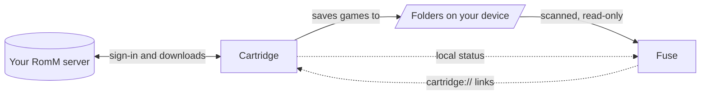

<div align="center">

<picture>
  <source media="(prefers-color-scheme: dark)" srcset="docs/assets/brand/banner-dark.svg">
  <source media="(prefers-color-scheme: light)" srcset="docs/assets/brand/banner-light.svg">
  
</picture>

<h3>Point it at your folders. Pick up a controller. Play.</h3>

Fuse gathers the games in your folders, dresses them in art and starts each one in the emulator you
already use, all from a console-style interface made for a gamepad. On Android it can even be your
Home screen.

<a href="https://github.com/MAtiyaaa/fuse/releases/latest"></a>
<a href="https://matiyaaa.github.io/fuse/"></a>

<a href="LICENSE"></a>
<a href="#privacy"></a>

<br>

<a href="https://github.com/MAtiyaaa/fuse/releases/latest"><picture><source media="(prefers-color-scheme: dark)" srcset="docs/assets/brand/button-android-dark.svg"></picture></a>
&nbsp;
<a href="https://github.com/MAtiyaaa/fuse/releases/latest"><picture><source media="(prefers-color-scheme: dark)" srcset="docs/assets/brand/button-linux-dark.svg"></picture></a>
<br>
<a href="https://github.com/MAtiyaaa/fuse/releases/latest"><picture><source media="(prefers-color-scheme: dark)" srcset="docs/assets/brand/button-windows-dark.svg"></picture></a>
&nbsp;
<a href="https://github.com/MAtiyaaa/fuse/releases/latest"><picture><source media="(prefers-color-scheme: dark)" srcset="docs/assets/brand/button-macos-dark.svg"></picture></a>

<sub>Android 9 or newer &nbsp;·&nbsp; 64-bit x86 Linux AppImage &nbsp;·&nbsp; Windows 10 and 11 &nbsp;·&nbsp; macOS on Apple silicon and Intel &nbsp;·&nbsp; <a href="#install">checksums and install notes</a></sub><br>
<sub>0.2.9 is the Organized Update: films on the screen you choose with a live swap, Addons in your order and organised in Settings, Jellyfin at home that connects, and Fuseline by Fuse at a tenth of Compose's cost. 0.2.8 brought Jellyfin and Fuse Player. <a href="#where-fuse-stands">Here is where it stands.</a></sub><br>
<sub>Or download from <a href="https://matiyaaa.github.io/fuse/">Fuse's website</a>, which always offers the latest version for your system.</sub>

<br>

<b><a href="#a-dark-room-lit-by-the-game-youre-on">Tour</a></b> &nbsp;&nbsp;·&nbsp;&nbsp;
<b><a href="#everything-in-its-place">Features</a></b> &nbsp;&nbsp;·&nbsp;&nbsp;
<b><a href="#install">Install</a></b> &nbsp;&nbsp;·&nbsp;&nbsp;
<b><a href="#romm-through-cartridge">Cartridge</a></b> &nbsp;&nbsp;·&nbsp;&nbsp;
<b><a href="#build-it-yourself">Build</a></b> &nbsp;&nbsp;·&nbsp;&nbsp;
<b><a href="#documentation">Docs</a></b>

</div>

<picture>
  <source media="(prefers-color-scheme: dark)" srcset="docs/assets/brand/divider-dark.svg">
  
</picture>

<div align="center">

## A dark room, lit by the game you're on

The game you are on sets the mood. Its art fills the room, its colour tints the glow, and the tile
under your thumb lifts toward you with a single sweep of light.

<a href="docs/assets/screenshots/library.webp"></a>

<sub><b>Library.</b> The game you're on fills the room.</sub>

</div>

<table>
  <tr>
    <td width="50%" valign="top">
      <a href="docs/assets/screenshots/home-channels.webp"></a>
      <br><b>Home, a board you arrange</b>
      <br><sub>Continue playing, your systems, what's new and your achievements, as tiles you place and resize yourself, or as a flowing Home if you like.</sub>
    </td>
    <td width="50%" valign="top">
      <a href="docs/assets/screenshots/systems.webp"></a>
      <br><b>Systems, with art of their own</b>
      <br><sub>Logos, artwork and colours for every system, with its game count and the emulator behind it.</sub>
    </td>
  </tr>
  <tr>
    <td width="50%" valign="top">
      <a href="docs/assets/screenshots/system-page.webp"></a>
      <br><b>A page for every system</b>
      <br><sub>Its games over the art of the one you're on, sorted and laid out the way you like for that system.</sub>
    </td>
    <td width="50%" valign="top">
      <a href="docs/assets/screenshots/apps.webp"></a>
      <br><b>Your emulators, found for you</b>
      <br><sub>On Android, every emulator on the device in one place, next to your pinned apps and an app drawer.</sub>
    </td>
  </tr>
  <tr>
    <td width="50%" valign="top">
      <a href="docs/assets/screenshots/quick-menu.webp"></a>
      <br><b>Everything at a press</b>
      <br><sub>The quick menu: time, battery left, Wi-Fi, screenshots and recordings, performance and more, from any screen.</sub>
    </td>
    <td width="50%" valign="top">
      <a href="docs/assets/screenshots/keyboard.webp"></a>
      <br><b>Type with a controller</b>
      <br><sub>A keyboard made for buttons and sticks, with a cursor, shortcuts on every face button, and paste.</sub>
    </td>
  </tr>
</table>

<p align="center"><sub>Screenshots taken with Fuse on an AYN Thor (1920 x 1080), with a real library and the art Fuse filled
in for it; system art from <a href="https://github.com/anthonycaccese/art-book-next-es-de">Art Book Next</a>. The games, their names and their art belong to their owners.
Fuse comes with no games and is not affiliated with them.</sub></p>

<picture>
  <source media="(prefers-color-scheme: dark)" srcset="docs/assets/brand/divider-dark.svg">
  
</picture>

<div align="center">

## Everything in its place

Made for the couch, the handheld and the desk. Fuse does the careful work so you only have to press
Play.

</div>

<table>
  <tr>
    <td width="33%" valign="top">
      <br>
      <b>Made for a controller</b><br>
      <sub>Key repeat that speeds up while held, hold to reorder, stick navigation with a deadzone, and button hints for Xbox, Nintendo, PlayStation or keyboard.</sub>
    </td>
    <td width="33%" valign="top">
      <br>
      <b>Your Home screen, if you like</b><br>
      <sub>On Android, Fuse can be the Home app, with an app drawer next to your games. It is optional and offered during setup.</sub>
    </td>
    <td width="33%" valign="top">
      <br>
      <b>Your folders, understood</b><br>
      <sub>ES-DE and RomM layouts, 69 platforms, multi-disc sets, and folder behaviour you choose per system or per game.</sub>
    </td>
  </tr>
  <tr>
    <td width="33%" valign="top">
      <br>
      <b>Launches, documented</b><br>
      <sub>More than 100 emulator and launcher definitions on Android and 35 on Linux, each with its source. No documented way in? Fuse opens the app and tells you why.</sub>
    </td>
    <td width="33%" valign="top">
      <br>
      <b>Your files, left alone</b><br>
      <sub>Fuse never moves or renames your files, and deletes a game's files only when you ask in Storage and confirm. A card or drive that is out is offline, never deleted games, and a drive back under another path is followed.</sub>
    </td>
    <td width="33%" valign="top">
      <br>
      <b>Art from where it already is</b><br>
      <sub>ES-DE and Batocera media first, then SteamGridDB, IGDB, TheGamesDB and libretro thumbnails. Art you choose is never replaced.</sub>
    </td>
  </tr>
  <tr>
    <td width="33%" valign="top">
      <br>
      <b>RetroAchievements</b><br>
      <sub>Your profile, recent unlocks and per-game progress on Home and on each game's page, cached so the service is asked no more than needed.</sub>
    </td>
    <td width="33%" valign="top">
      <br>
      <b>RomM, through Cartridge</b><br>
      <sub>Pair with the Cartridge app to follow each download, pick up new games when you come back, bring in RomM's details and art, and jump to a game's RomM entry.</sub>
    </td>
    <td width="33%" valign="top">
      <br>
      <b>A second screen that helps</b><br>
      <sub>On two-screen devices (Android 10 and later) the companion shows the focused game or system, or the game you are playing and its session time, and stays beside games and apps you open.</sub>
    </td>
  </tr>
  <tr>
    <td width="33%" valign="top">
      <br>
      <b>Phone Link</b><br>
      <sub>Manage your library from a phone on the same Wi-Fi: see what's playing and downloading, fix names, details and art, start art fills, and download your screenshots and recordings. Signed in with a password you set on the device; a phone can't delete anything or see keys.</sub>
    </td>
    <td width="33%" valign="top">
      <br>
      <b>Storage at a glance</b><br>
      <sub>Every drive by name, connected or not, as a bar by system, every game by the space it takes, and deleting the games you're done with, after a confirmation that names what goes.</sub>
    </td>
    <td width="33%" valign="top">
      <br>
      <b>Collections and series</b><br>
      <sub>Your own collections, plus the series Fuse finds on its own from game details and shared titles. Hide one, or keep it as yours.</sub>
    </td>
  </tr>
  <tr>
    <td width="33%" valign="top">
      <br>
      <b>Ten themes, and yours</b><br>
      <sub>Fuse, Glass, Starlight, Crossbar, Orbital, Wave, Blades, Channels, CRT and Daylight, each with its own background, corners, focus, motion and sound. Add themes others made from a link or a file, or <a href="docs/THEMES.md">write your own</a>.</sub>
    </td>
    <td width="33%" valign="top">
      <br>
      <b>Focus you can always see</b><br>
      <sub>The focus spark never relies on colour alone. Four motion levels, including Reduced, High contrast focus, three text sizes, and margins for TVs that cut off the picture's edges.</sub>
    </td>
    <td width="33%" valign="top">
      <br>
      <b>Private by design</b><br>
      <sub>No telemetry, analytics, ads or crash reporting. Online services are used only after you set them up.</sub>
    </td>
  </tr>
  <tr>
    <td width="33%" valign="top">
      <br>
      <b>System health</b><br>
      <sub>What needs attention in your setup, most serious first, each with the fix: folders, drives, emulators, firmware, playlists and keys. A diagnostics report for bug reports, with anything personal taken out.</sub>
    </td>
    <td width="33%" valign="top">
      <br>
      <b>Backup and restore</b><br>
      <sub>One file with your settings, Home, what you changed on games, collections, chosen art and play time. Restoring merges and never deletes, and finds your games on another card. Never games, firmware or keys.</sub>
    </td>
    <td width="33%" valign="top">
      <br>
      <b>Search that understands</b><br>
      <sub>Filters like <code>platform:snes</code>, <code>year:1990s</code> or <code>played:week</code> as chips, values offered as you type so a controller never has to spell them, typos forgiven, and every setting findable.</sub>
    </td>
  </tr>
</table>

### In detail

<details>
<summary><b>Library and folders</b></summary>
<br>

- **Library roots** in ES-DE style `ROMs/<system>` folders, RomM Structure A and B libraries, single
  platform folders and folders of Steam or PC shortcuts.
- **69 platforms** recognised by RomM slug, RomM alias, ES-DE name or full name.
- **One game, however it is stored.** Multi-disc sets, `.m3u`, `.cue` and `.gdi` files, PS3, PS Vita,
  PSP, Wii U, Xbox 360 and PC game folders, RomM content folders (DLC, updates, patches, hacks,
  translations and more) and loose Switch updates are each grouped into one game.
- **Folder behaviour you control**: Auto, File, Folder as game or Folder browser, set globally, per
  system or per game.
- **Android games** in their own system: any installed app can be a game, an app or an emulator, and
  games get box art, details and play time like the rest.
- **A game in the wrong system** moves to the right one from its options, and stays there.
- **Add a game from anywhere**: an installed app, an APK file, or a game file outside your library
  folders, picked with Fuse's own file picker.
- **Quick rescans** only read the folders that changed.
- **Your files, left alone.** Fuse never moves or renames your files, and deletes a game's files only
  when you ask in Settings, Storage and backups and confirm (never from Phone Link). Missing games are marked,
  not removed, and playlists for multi-disc games are written to Fuse's own cache.
- **BIOS checks** report Unknown, never Missing, when a location cannot be read.

</details>

<details>
<summary><b>Launching</b></summary>
<br>

- **Documented, not guessed.** Emulators and launchers are described as data, each with its source
  (ES-DE's MIT-licensed configuration, the emulator's own code or its vendor's guide) and a
  confidence level.
- **More than 100 definitions on Android** (RetroArch, Dolphin, PPSSPP, DuckStation, NetherSX2,
  ARMSX2, aPS3e, melonDS, Azahar, Eden, Vita3K, Flycast, Lemuroid, MAME4droid, ScummVM and many
  more), **35 on Linux**, found on `$PATH`, as Flatpaks or as AppImages (RetroArch, PCSX2, RPCS3,
  Dolphin, Cemu, Ryujinx, xemu, Xenia, shadPS4, MAME, DOSBox Staging and more), **32 on Windows**,
  found in portable folders, Program Files, AppData, Scoop, Chocolatey, winget and Steam libraries,
  and **29 on macOS**, found as apps or Homebrew programs. Anything Fuse misses on Windows or macOS
  can be located from Settings.
- **Pick an emulator** per system or per game. Forks and renamed builds are recognised by family, and
  shared package names are trusted only after Fuse checks that the expected activity exists.
- **Honest fallbacks.** When an app has no documented way to start a specific game, Fuse opens the app
  and says why.
- **Steam and Windows games** start through GameNative, GameHub Lite, Winlator Cmod, WinNative or
  Bannerlator on Android, through Steam or `.desktop` shortcuts on Linux, and as they are on Windows
  (`.exe` games, `.lnk` shortcuts and `.bat` scripts).
- **DLC and updates**: Fuse explains, per emulator, how they are used.
- **Installs PS3, Vita and 3DS games itself**: packages, updates, DLC and licences, from any drive,
  into RPCS3, Vita3K and Azahar. They go in the right order, missing licences are shown first, and
  each step is checked in the emulator's storage. The game page says Ready to play, Needs
  installation, Missing licence, or Update or DLC available locally.
- **Every emulator has a page**: how it was found, what it runs, how Fuse starts it and its limits,
  with a test launch. A game's emulator list says why one can't open that game.
- **PCSX2 patches** (widescreen, 60 FPS and more) for a PS2 game, turned on in PCSX2's own settings
  for that game. Fuse only turns off what it turned on, and leaves anything set in PCSX2 alone.
- **PlayStation disc details**: the serial and PCSX2's CRC, read from ISO and BIN images.
- **How a PS3 game runs in RPCS3**, from RPCS3's compatibility list, asked only when you choose it.
- **Problems that explain themselves**: when a game can't start, Fuse says why, that nothing was
  changed, and offers the fix. If Fuse itself fails to start three times, it starts in **safe mode**.

</details>

<details>
<summary><b>Art and details</b></summary>
<br>

- Media already in **ES-DE and Batocera** layouts is used first.
- **Square box art** for every game, from SteamGridDB, your own folders or a file; games without it
  show their cover whole instead of cropped.
- **SteamGridDB, IGDB, TheGamesDB and libretro thumbnails** fill the rest, with your own keys where a
  service needs one, by themselves after a scan if you like. When a source runs out of requests,
  the others take over. The ScreenScraper client is built in and waits for developer credentials, so in
  0.0.1 it makes no requests.
- **Found however the file is named**: No-Intro, Redump, GoodTools, TOSEC and scene names, serials
  and title ids anywhere in the name, list numbers and versions; exact names always win.
- Uncertain matches are **shown to you** before anything is saved.
- **Art you choose yourself is never replaced**, except when you ask to reset it.
- Games without art get **generated placeholder art** instead of a blank tile.

</details>

<details>
<summary><b>Controllers and interface</b></summary>
<br>

- Custom **key repeat** that accelerates while held, **hold to reorder**, **stick navigation** with
  deadzones, **Detect my buttons** (Xbox, Nintendo or PlayStation layout from two presses), and hint
  glyphs for Xbox, Nintendo, PlayStation or keyboard.
- A **button mapping** screen with capture and a live button test that no button can leave by accident.
- **Home** as a flowing dashboard of rows (Flow) or a board of widgets you move and resize like a
  phone's home screen (Channels): 19 kinds of widgets, each designed for every size from one cell to
  four by three.
- **Library** layouts from square box art to capsules to covers to a compact list; **Systems**, **Apps**
  (on Android), **Search** with filters, game pages, a media manager, a folder browser, the **quick
  menu**, a **Play time** page and a guided setup.
- **Nineteen themes** and community themes from a link or a file ([docs/THEMES.md](docs/THEMES.md)), square
  box art or tall posters, four motion levels including Reduced, High contrast focus, optional glass
  panels and CRT effect, and interface sounds synthesised on the fly.
- A **performance overlay** that only shows metrics the device can really measure.
- **Screenshots and recordings** of Fuse on Android: from the quick menu after a 3 second countdown,
  or at once with L3 + R3 (hold to record), saved to Pictures/Fuse and Movies/Fuse with Fuse's music.

</details>

<details>
<summary><b>Android, Linux, Windows and macOS</b></summary>
<br>

<table>
  <tr>
    <td width="50%" valign="top">
      <br>
      <b>Android</b> <sub>9 or newer</sub>
      <ul>
        <li>Optional Home screen mode and an app drawer, with Fuse kept in recent apps</li>
        <li>A companion screen on a second display (Android 10 and later)</li>
        <li>In-app updates, downloaded only after you confirm and checked against their SHA-256 digest</li>
        <li>Keys and passwords kept in the Android Keystore</li>
        <li>Interface sounds and haptics</li>
        <li>Screenshots and screen recordings of Fuse</li>
      </ul>
    </td>
    <td width="50%" valign="top">
      <br>
      <b>Linux</b> <sub>64-bit x86</sub>
      <ul>
        <li>A single AppImage, and an optional login entry</li>
        <li>Full screen, borderless or window, from Settings, F11 or the command line</li>
        <li>Gamepad input from <code>/dev/input/js*</code>, with no extra drivers</li>
        <li>Keys kept in the Secret Service, with an encrypted-file fallback</li>
        <li>Steam and <code>.desktop</code> shortcuts next to your emulators</li>
      </ul>
    </td>
  </tr>
  <tr>
    <td width="50%" valign="top">
      <br>
      <b>Windows</b> <sub>10 and 11, 64-bit</sub>
      <ul>
        <li>An installer for your account (no administrator needed), or a portable zip that keeps everything next to it</li>
        <li>Controllers through SDL, like most emulators</li>
        <li>Keys protected by Windows for your account (DPAPI)</li>
        <li><code>.exe</code> games, <code>.lnk</code> shortcuts and <code>.bat</code> scripts next to your emulators</li>
        <li>Emulators you keep anywhere: show Fuse where with Locate</li>
      </ul>
    </td>
    <td width="50%" valign="top">
      <br>
      <b>macOS</b> <sub>Apple silicon (11 or newer) and Intel (10.15 or newer)</sub>
      <ul>
        <li>A disk image for each kind of Mac</li>
        <li>Controllers through SDL, like most emulators</li>
        <li>Keys kept in the Keychain</li>
        <li>Emulators as apps or Homebrew programs, found in Applications and the folders inside it</li>
        <li>An optional login item</li>
      </ul>
    </td>
  </tr>
</table>

On every computer Fuse manages games only: there is no Apps section, and Cartridge, an Android and
Linux app, isn't offered on Windows and macOS.

</details>

## Where Fuse stands

> [!IMPORTANT]
> **Fuse 0.2.9 "The Organized Update" is still early.** It plays films on the screen you choose on
> a two-screen handheld and swaps them live, hides the second screen, lets Addons' tabs be put in
> any order and gathers Jellyfin, the Store and Cartridge in Settings, Addons, connects to a
> Jellyfin server at home, and makes Fuseline by Fuse share one frame among every move (see
> [the release notes](docs/releases/0.2.9.md)). 0.2.8 brought your Jellyfin server's films, shows
> and music into Addons, played in Fuse Player, Fuse's own player, let a phone type into Fuse and
> play it as a controller, and redesigned Storage ([Jellyfin](docs/jellyfin.md),
> [Fuse Player](docs/player.md)). 0.2.7 put Fuse's menus on a dual-screen handheld's touch screen,
> with the chosen game large on the main screen, like a 3DS. 0.2.6 brought a Store to Linux, Windows and macOS,
> moved games to an SD card or another drive, showed Steam achievements and RPCS3 trophies, and
> rebuilt setup. 0.2.5 started Fuse with its own logo burning in,
> and opened games and apps cleanly on a dual-screen handheld's bottom screen. 0.2.4 brought installs of PS3, Vita and 3DS games,
> their updates, DLC and licences into RPCS3, Vita3K and Azahar through each emulator's own
> installer, checked step by step, 0.2.3 brought the guided Theme Studio and Store
> support for every app it lists, 0.2.1 the Store and Addons, 0.2.0 SD cards and drives that come and
> go, System health, backups and PCSX2 patches, 0.1.6 the resizable widget board, 0.1.4 downloads
> from your phone, 0.1.3 screenshots and recordings, and 0.1.0 Windows and macOS. The shared core
> (library scanning, launch resolution, integrations and the database) and the interface are in
> place and tested where it matters. The Android app builds and passes its unit tests and lint, and
> has been tried on one handheld so far. The Linux app builds, passes its tests, packages as an
> AppImage and starts in a virtual display. The Windows and macOS builds pass their tests and a
> self-test of the packaged app on each system in CI, but haven't been tried by hand on a PC or Mac
> yet. Installing into real emulators hasn't been tried by hand yet either. Expect rough edges and
> changes between versions.

Not there yet: checks on more handhelds and on Windows and Mac computers, signed Windows and macOS
builds, video previews and screen capture on the desktop, a storage mode without All files access, translations (the
interface is English only), RetroAchievements hashing for 3DS, Saturn, Dreamcast and compressed disc
images, and ScreenScraper credentials. [ROADMAP.md](ROADMAP.md) ticks a box only when the
code is in this repository.

**Tried it on your device?** A short report ("this emulator launches on my handheld") helps more than
anything right now. [Open an issue](https://github.com/MAtiyaaa/fuse/issues) or see
[CONTRIBUTING.md](CONTRIBUTING.md).

## Install

Download the latest files from the [Releases page](https://github.com/MAtiyaaa/fuse/releases/latest):

| File | For |
|---|---|
| `Fuse-<version>-android.apk` | Android 9 or newer |
| `Fuse-<version>-x86_64.AppImage` | 64-bit x86 Linux |
| `Fuse-<version>-windows-x64.msi` | Windows 10 and 11, 64-bit (installer) |
| `Fuse-<version>-windows-x64.zip` | Windows 10 and 11, 64-bit (portable) |
| `Fuse-<version>-macos-arm64.dmg` | Macs with Apple silicon, macOS 11 or newer |
| `Fuse-<version>-macos-x64.dmg` | Intel Macs, macOS 10.15 or newer |
| `SHA256SUMS.txt` | Checksums for all of them |

The APK is published first; the computer builds join the release a little later.

Check what you downloaded:

```sh
sha256sum -c SHA256SUMS.txt --ignore-missing
```

<table>
  <tr>
    <td width="50%" valign="top">
      &nbsp;<b>Android</b>
      <p>Open the APK and allow your browser or file manager to install apps when asked. Fuse works as a normal app; making it your Home screen is optional and offered during setup.</p>
      <p>To read your folders and hand games to emulators that need file paths or FileProvider links, Fuse asks for All files access, the same access ES-DE uses. Fuse only reads: it never moves, renames or deletes your files.</p>
    </td>
    <td width="50%" valign="top">
      &nbsp;<b>Linux</b>
      <p>Make the AppImage executable and run it:</p>
      <pre><code>chmod +x Fuse-*-x86_64.AppImage
./Fuse-*-x86_64.AppImage</code></pre>
      <p>If it does not start, your distribution may need the FUSE 2 library (<code>libfuse2</code>, or <code>libfuse2t64</code> on newer Ubuntu and Debian). See the <a href="https://docs.appimage.org/user-guide/troubleshooting/fuse.html">AppImage FUSE guide</a>.</p>
    </td>
  </tr>
  <tr>
    <td width="50%" valign="top">
      &nbsp;<b>Windows</b>
      <p>Run the <code>.msi</code>: it installs Fuse for your account, with no administrator prompt, and a later version installs over it. Or unzip the portable <code>.zip</code> anywhere (a USB drive works) and run <code>Fuse.exe</code>; it keeps its library and settings in the <code>FuseData</code> folder beside it.</p>
      <p>Fuse isn't signed by Microsoft yet, so SmartScreen may warn the first time: choose <b>More info</b>, then <b>Run anyway</b>.</p>
    </td>
    <td width="50%" valign="top">
      &nbsp;<b>macOS</b>
      <p>Open the disk image for your Mac (<code>arm64</code> for Apple silicon, <code>x64</code> for Intel) and drag Fuse to Applications.</p>
      <p>Fuse isn't notarized by Apple yet. The first time, right-click Fuse and choose <b>Open</b>, or allow it in System Settings, Privacy &amp; Security. From Terminal, this does the same:</p>
      <pre><code>xattr -dr com.apple.quarantine /Applications/Fuse.app</code></pre>
    </td>
  </tr>
</table>

Fuse does not include emulators, BIOS files or games. Install the emulators you want; Fuse finds them
automatically.

## RomM through Cartridge

<a href="docs/assets/screenshots/cartridge.webp"></a>

Fuse does not talk to RomM servers. [Cartridge](https://github.com/abdu2304/cartridge) by
[abdu2304](https://github.com/abdu2304), a RomM companion app, signs in to your RomM server, keeps
the credentials, and downloads games into folders on your device. Fuse scans those folders like any other and reads Cartridge's local status to show
what it is doing.



To pair them:

1. Install Cartridge 0.9.10 or newer (Settings, Accounts, Cartridge in Fuse can install it from Cartridge's
   GitHub releases after you confirm). RomM's details, each game's download progress and uploading
   games to RomM need Cartridge 0.9.11 "The Bridge Expansion", with bridge protocols 2 and 3 (in
   review as [MAtiyaaa/cartridge#30](https://github.com/MAtiyaaa/cartridge/pull/30)).
2. Sign in to RomM inside Cartridge and download some games.
3. In Fuse, add the folder Cartridge saves to as a library, if setup did not suggest it already.

On Android, Fuse reads Cartridge's status through a read-only content provider protected by a
Cartridge permission; on Linux it reads `~/.local/state/cartridge/status.json`
(`$XDG_STATE_HOME/cartridge/status.json`). Fuse opens Cartridge on a specific page, platform or game
with `cartridge://` links. It can also hand Cartridge a game to upload to your RomM server ("Upload
to RomM" in a game's options): Cartridge shows the files and uploads only after you confirm there.
**No server address, token or password ever passes between the two apps.**
The full protocol is in [INTEGRATIONS.md](INTEGRATIONS.md#cartridge-bridge-protocol).

## Build it yourself

You need JDK 17 or newer and, for Android, the Android SDK with API level 37 installed.

```sh
./gradlew :app:android:assembleDebug   # Android debug APK
./gradlew :app:desktop:run             # run the desktop app
./gradlew allTests                     # every test
```

[BUILDING.md](BUILDING.md) covers tests per module, the AppImage and release signing.

## Privacy

Fuse contains **no telemetry, analytics, advertising or crash reporting**, and your library works
fully offline. Fuse only contacts a service after you set it up: RetroAchievements, SteamGridDB, IGDB,
TheGamesDB, ScreenScraper and libretro thumbnails receive only what they need to answer (for example a
game's title, or your own API key). The one service used without setup is GitHub, to check for new
versions of Fuse; you can turn automatic checks off in Settings, About, and nothing is ever
downloaded or installed without your confirmation. rpcs3.net is asked, with only a game's title id,
when you choose How It Runs in RPCS3. Backups and diagnostics reports are files you save yourself;
Fuse never sends them anywhere. API keys and passwords are kept in the system's
secure storage, never in logs or in the database. [INTEGRATIONS.md](INTEGRATIONS.md) lists exactly
what each service receives and when.

## Documentation

| Document | What it covers |
|---|---|
| [ARCHITECTURE.md](ARCHITECTURE.md) | Modules, domain model, scanning, launching, input, storage, security |
| [INTEGRATIONS.md](INTEGRATIONS.md) | Every online service and the Cartridge bridge, and what leaves the device |
| [DESIGN_SYSTEM.md](DESIGN_SYSTEM.md) | Tokens, type, focus, motion, themes, sound, accessibility |
| [docs/THEMES.md](docs/THEMES.md) | Writing, sharing and adding themes |
| [RESEARCH.md](RESEARCH.md) | What we learned about frontends, Android, emulators, RomM and scrapers |
| [ROADMAP.md](ROADMAP.md) | What is done and what comes next |
| [BUILDING.md](BUILDING.md) | Building, testing, packaging and signing |
| [CONTRIBUTING.md](CONTRIBUTING.md) | How to contribute |
| [CHANGELOG.md](CHANGELOG.md) | Release history |
| [THIRD_PARTY_NOTICES.md](THIRD_PARTY_NOTICES.md) | Licences of everything Fuse uses |

## Licence

Copyright (C) 2026 the Fuse contributors.

Fuse is free software: you can redistribute it and/or modify it under the terms of the GNU General
Public License as published by the Free Software Foundation, either version 3 of the License, or (at
your option) any later version (`GPL-3.0-or-later`). See [LICENSE](LICENSE). Fuse is distributed in
the hope that it will be useful, but without any warranty.

Third-party components keep their own licences; see [THIRD_PARTY_NOTICES.md](THIRD_PARTY_NOTICES.md).

## Credits

- [ES-DE](https://es-de.org/), whose MIT-licensed emulator configuration is the best public record of
  how emulators accept games.
- [RomM](https://github.com/rommapp/romm), whose folder conventions and platform names Fuse follows.
- **[Cartridge](https://github.com/abdu2304/cartridge) by [abdu2304](https://github.com/abdu2304)**
  (MIT), the RomM companion Fuse pairs with, and where Fuse learned to match emulator forks by name.
  Fuse's bridge (live downloads, deep links and uploads) is being contributed to Cartridge; until
  it is merged there, Fuse installs Cartridge from the [MAtiyaaa/cartridge](https://github.com/MAtiyaaa/cartridge)
  fork, and will switch to abdu2304's releases once it is.
- [rcheevos](https://github.com/RetroAchievements/rcheevos) and
  [RetroAchievements](https://retroachievements.org/).
- **Music by boipurple.** Fuse's menu music is the album *jam channel* by boipurple: puddleworld
  plays under the menus and alright apothecary during setup, and every song on the album can be
  picked in Settings, Sound. The songs remain the artist's own and are not covered by Fuse's
  licence.
- [Lucide](https://lucide.dev/) icons (ISC), and the [Sora](https://github.com/sora-xor/sora-font) and
  [Manrope](https://github.com/googlefonts/manrope) typefaces (SIL Open Font License).
- Kotlin, Compose Multiplatform, SQLDelight, Ktor, Coil and kotlinx libraries.
- The emulator and launcher developers whose work Fuse starts.

<sub>iiSU was studied as a reference for quality only; no code or assets were taken from it, nor from
Sony, Microsoft or Nintendo. Console and game names are trademarks of their owners and are used only
to identify systems. Fuse ships no console artwork, console sounds, BIOS files or games.</sub>

<br>

<div align="center">
<picture>
  <source media="(prefers-color-scheme: dark)" srcset="docs/assets/brand/mark-dark.svg">
  
</picture>
<br>
<sub>Fuse is free software, made in spare time for everyone who plays with a controller.</sub>
</div>
