<div align="center">

<picture>
  <source media="(prefers-color-scheme: dark)" srcset="docs/assets/brand/banner-dark.svg">
  <source media="(prefers-color-scheme: light)" srcset="docs/assets/brand/banner-light.svg">
  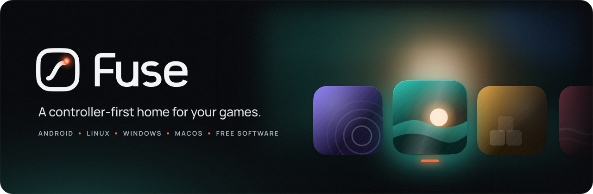
</picture>

<h3>Point it at your folders. Pick up a controller. Play.</h3>

Fuse gathers the games in your folders, dresses them in art and starts each one in the emulator you
already use, all from a console-style interface made for a gamepad. On Android it can even be your
Home screen.

<a href="https://github.com/MAtiyaaa/fuse/releases/latest"></a>
<a href="https://matiyaaa.github.io/fuse/"></a>

<a href="LICENSE"></a>
<a href="#privacy"></a>

<br>

<a href="https://github.com/MAtiyaaa/fuse/releases/latest"><picture><source media="(prefers-color-scheme: dark)" srcset="docs/assets/brand/button-android-dark.svg"></picture></a>
&nbsp;
<a href="https://github.com/MAtiyaaa/fuse/releases/latest"><picture><source media="(prefers-color-scheme: dark)" srcset="docs/assets/brand/button-linux-dark.svg"></picture></a>
<br>
<a href="https://github.com/MAtiyaaa/fuse/releases/latest"><picture><source media="(prefers-color-scheme: dark)" srcset="docs/assets/brand/button-windows-dark.svg"></picture></a>
&nbsp;
<a href="https://github.com/MAtiyaaa/fuse/releases/latest"><picture><source media="(prefers-color-scheme: dark)" srcset="docs/assets/brand/button-macos-dark.svg"></picture></a>

<sub>Android 9 or newer &nbsp;·&nbsp; 64-bit x86 Linux AppImage &nbsp;·&nbsp; Windows 10 and 11 &nbsp;·&nbsp; macOS on Apple silicon and Intel &nbsp;·&nbsp; <a href="#install">checksums and install notes</a></sub><br>
<sub>0.4.1 is <b>The Convergence Update</b>, built directly on shipped Fuseline 4: durable profile revisions, stronger household identity, safe save importing, independent display refresh and desktop rendering work. This branch is still undergoing integration and physical acceptance. <a href="docs/audits/0.4.1-convergence.md">Engineering acceptance record.</a></sub><br>
<sub>Or download from <a href="https://matiyaaa.github.io/fuse/">Fuse's website</a>, which always offers the latest version for your system.</sub>

<br>

<b><a href="#a-dark-room-lit-by-the-game-youre-on">Tour</a></b> &nbsp;&nbsp;·&nbsp;&nbsp;
<b><a href="#made-by-fuse">Made by Fuse</a></b> &nbsp;&nbsp;·&nbsp;&nbsp;
<b><a href="#everything-in-its-place">Features</a></b> &nbsp;&nbsp;·&nbsp;&nbsp;
<b><a href="#install">Install</a></b> &nbsp;&nbsp;·&nbsp;&nbsp;
<b><a href="#fuse-romm-fuses-native-romm-integration">Fuse RomM</a></b> &nbsp;&nbsp;·&nbsp;&nbsp;
<b><a href="#romm-through-cartridge">Cartridge</a></b> &nbsp;&nbsp;·&nbsp;&nbsp;
<b><a href="#build-it-yourself">Build</a></b> &nbsp;&nbsp;·&nbsp;&nbsp;
<b><a href="#documentation">Docs</a></b>

</div>

<picture>
  <source media="(prefers-color-scheme: dark)" srcset="docs/assets/brand/divider-dark.svg">
  
</picture>

<div align="center">

## A dark room, lit by the game you're on

The game you are on sets the mood. Its art fills the room, its colour tints the glow, and the tile
under your thumb lifts toward you with a single sweep of light.

<a href="docs/assets/screenshots/library.webp">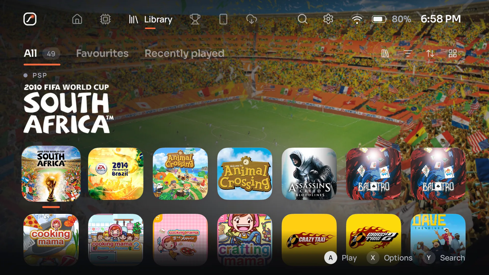</a>

<sub><b>Library.</b> The game you're on fills the room.</sub>

</div>

<table>
  <tr>
    <td width="50%" valign="top">
      <a href="docs/assets/screenshots/home-channels.webp">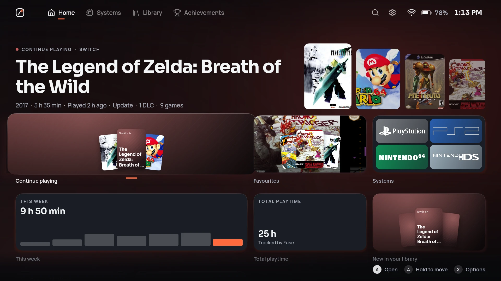</a>
      <br><b>Home, a board you arrange</b>
      <br><sub>Continue playing, your systems, what's new and your achievements, as tiles you place and resize yourself, or as a flowing Home if you like.</sub>
    </td>
    <td width="50%" valign="top">
      <a href="docs/assets/screenshots/systems.webp">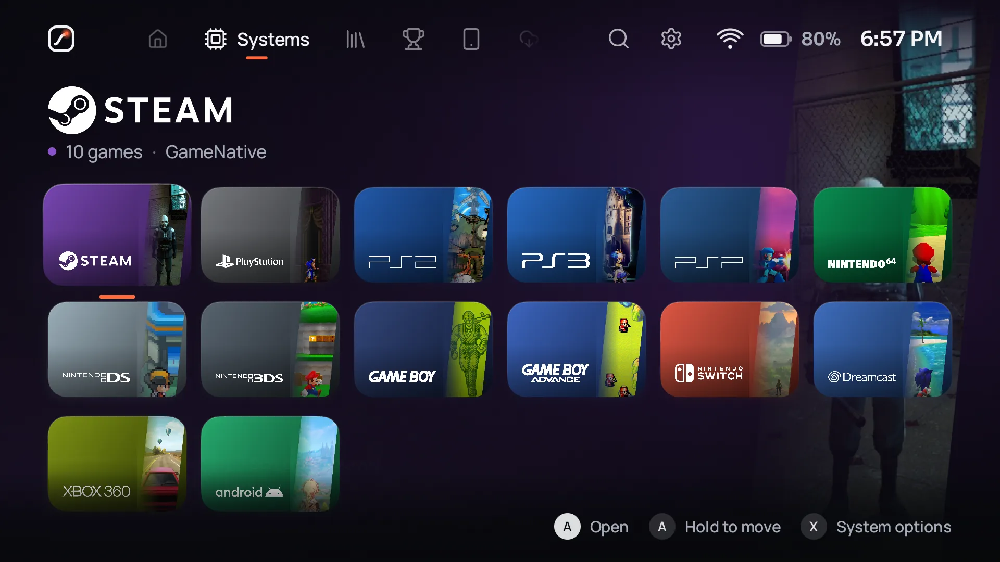</a>
      <br><b>Systems, with art of their own</b>
      <br><sub>Logos, artwork and colours for every system, with its game count and the emulator behind it.</sub>
    </td>
  </tr>
  <tr>
    <td width="50%" valign="top">
      <a href="docs/assets/screenshots/system-page.webp">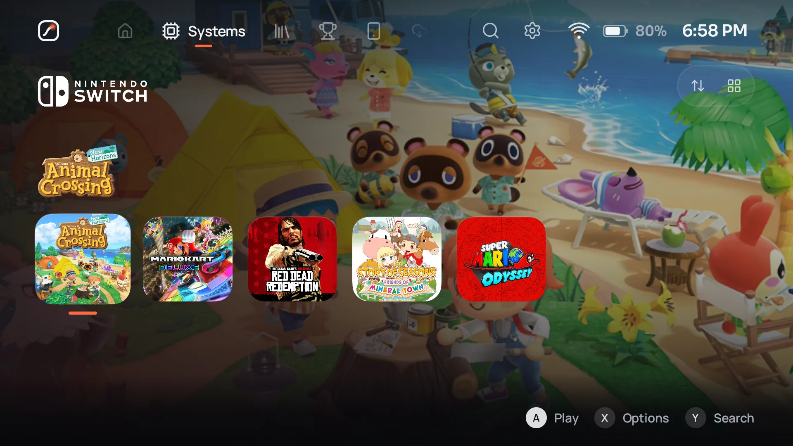</a>
      <br><b>A page for every system</b>
      <br><sub>Its games over the art of the one you're on, sorted and laid out the way you like for that system.</sub>
    </td>
    <td width="50%" valign="top">
      <a href="docs/assets/screenshots/apps.webp">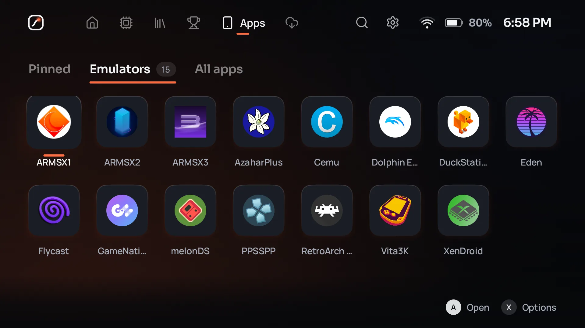</a>
      <br><b>Your emulators, found for you</b>
      <br><sub>On Android, every emulator on the device in one place, next to your pinned apps and an app drawer.</sub>
    </td>
  </tr>
  <tr>
    <td width="50%" valign="top">
      <a href="docs/assets/screenshots/quick-menu.webp">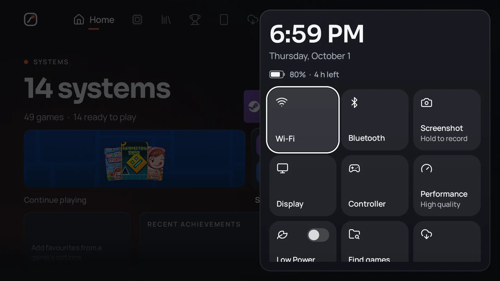</a>
      <br><b>Everything at a press</b>
      <br><sub>The quick menu: time, battery left, Wi-Fi, screenshots, what is playing and more, from any screen, arranged the way you like.</sub>
    </td>
    <td width="50%" valign="top">
      <a href="docs/assets/screenshots/keyboard.webp">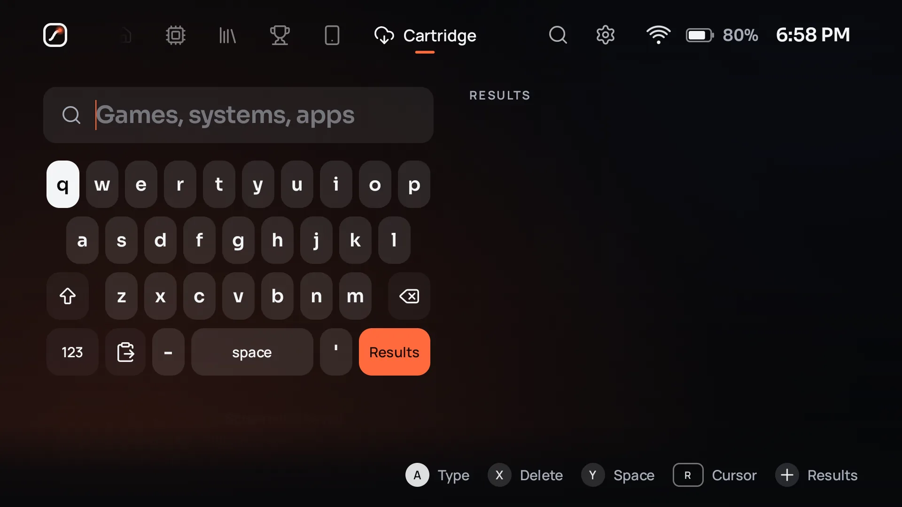</a>
      <br><b>Type with a controller</b>
      <br><sub>A keyboard made for buttons and sticks, with a cursor, shortcuts on every face button, and paste.</sub>
    </td>
  </tr>
</table>

<p align="center"><sub>Screenshots taken with Fuse on an AYN Thor (1920 x 1080), with a real library and the art Fuse filled
in for it; system art from <a href="https://github.com/anthonycaccese/art-book-next-es-de">Art Book Next</a>. The games, their names and their art belong to their owners.
Fuse comes with no games and is not affiliated with them.</sub></p>

<picture>
  <source media="(prefers-color-scheme: dark)" srcset="docs/assets/brand/divider-dark.svg">
  
</picture>

<div align="center">

## Made by Fuse

The parts you feel most are Fuse's own: written for Fuse, in this repository, under its licence.
They behave the same on every device, answer to one design, and get better with every release.

</div>

<table>
  <tr>
    <td colspan="2" valign="top">
      <br>
      <h3>Fuse Sync <sub>by Fuse</sub></h3>
      Your saves, play time, library and settings, the same on every device you play on, from a
      computer of your own at home. Stop on the PC, carry on on the handheld; nothing goes to anyone
      else's server, and nothing is ever silently lost.
      <ul>
        <li><b>Saves where you play.</b> The newest save is put in place before a game starts and kept
        after it closes, matched by the game, not the path, in over 60 emulators: RetroArch,
        DuckStation, PCSX2, PPSSPP, Dolphin, melonDS, DraStic, Mupen64Plus, RPCS3, Vita3K, shadPS4,
        Flycast, Azahar for 3DS, Eden and Ryujinx for Switch, Cemu for Wii U, Xenia and more. Save
        Folders shows where each one keeps them, and takes a folder you chose.</li>
        <li><b>Play time that adds up.</b> 30 minutes on one device and 20 offline on another is 50,
        never 30 and never 80. Everything works offline and catches up later.</li>
        <li><b>Synced everywhere, by itself.</b> A save made on one device reaches every other
        device with the game in the background, without launching it, and devices that were off
        catch up when they return. Each game says "Synced everywhere" or "4 of 5 devices current".</li>
        <li><b>Asks, never guesses.</b> When two devices both played, you choose which save to use;
        the other is kept. Every save keeps its versions, from every device, to go back to.</li>
        <li><b>A profile for each person</b>, with one of Fuse's own avatars and a PIN if they like:
        their own saves (even on a device everyone shares), library, favourites, collections, Home
        and theme, switched in place, no restart. Profiles work without a host too, and go with you
        when the device joins one. A game can be one save for everyone too.</li>
        <li><b>One click to host</b> on Linux, Windows or macOS, kept running when Fuse is closed and
        after a restart; devices find it on the network and ask to join (anyone already in says yes
        after checking a number), or type a code. The host plays as its own Admin. Signed requests,
        revocable devices, and an outside address for away from home.</li>
        <li><b>The Hub shows everything.</b> In Fuse and in a browser on the host: every game's saves
        and their versions, which device made each one, how big it is, where the host keeps it, and
        total play time by profile and by device.</li>
        <li><b>Only what you made.</b> Saves, states, memory cards, play time and settings; your games
        themselves are never copied or synced.</li>
        <li><b>Already run Syncthing?</b> Fuse can share your emulators' save folders through it
        instead, bring in the newest save before a game and ask when two devices both played.</li>
      </ul>
      <a href="docs/sync.md"><b>How Fuse Sync works</b></a>
    </td>
  </tr>
  <tr>
    <td width="50%" valign="top">
      <br>
      <h3>Fuse Player <sub>by Fuse</sub></h3>
      Fuse's own video and music player, for your films, shows and music from Jellyfin, with its own
      controls, subtitles and remote. Not a web page, not another app: part of Fuse.
      <ul>
        <li><b>Two engines, one player.</b> Media3 on Android; FFmpeg on Linux, Windows and macOS,
        decoding on the GPU where it can (VAAPI, D3D11VA, VideoToolbox).</li>
        <li><b>Starts fast, keeps playing.</b> A short first buffer, a deep one behind it, retries
        on a flaky link, and when Wi-Fi can't keep up, it lowers the quality by itself and carries on
        from the same second.</li>
        <li><b>Subtitles drawn by Fuse</b> on every platform: SRT, WebVTT, ASS with its styles, PGS
        and DVD pictures, with size, position and delay you set.</li>
        <li><b>Made for a controller</b>, with seeking that speeds up while held, and for touch:
        double tap to skip, drag the timeline, tap outside a sheet to close it.</li>
        <li><b>Two screens:</b> the film on one, a full remote on the other, swapped live while it plays.</li>
      </ul>
      <a href="docs/player.md"><b>How Fuse Player works</b></a>
    </td>
    <td width="50%" valign="top">
      <br>
      <h3>Fuseline <sub>by Fuse</sub></h3>
      Fuse's own animation engine, named after the line in Fuse's logo that carries the spark. Every
      movement in Fuse runs on it, from a tile's lift to the setup's opening. Fuse 0.3.7 brought
      <b>Fuseline 3</b>, where motion never breaks, 0.3.7.5 <b>Fuseline 3.1</b>, which took work off
      every frame around it, and 0.4.0 brings <b>Fuseline 4</b>, which no longer runs motion just
      because time passes.
      <ul>
        <li><b>Fuseline 4: worked out when it is read.</b> Every motion is solved in closed form, so
        a value is worked out from its formula for the frame being shown, exactly where stepping it
        every frame would have left it, without the frames.</li>
        <li><b>Fuseline 4: left alone until it could be seen to change.</b> A value proves the first
        moment it could move far enough to be seen and isn't touched before then; a value nobody is
        looking at rests until it arrives, and comes back exactly where it would have been.</li>
        <li><b>Fuseline 4: shared motion, solved once.</b> Every value on the same spring shares one
        solution a frame, and a colour's four numbers solve their curve once.</li>
        <li><b>Fuseline 3.1: values without coroutines.</b> A tile's lift, a button's colour and a
        panel's size follow their targets with no coroutine of their own, so a page of tiles
        composes faster and in a third of the memory.</li>
        <li><b>Fuseline 3.1: no invisible frames, and decoration that waits for you.</b> A frame that
        would move something less than anyone could see isn't drawn again, and the theme's room
        holds still while you press buttons, then carries on as before.</li>
        <li><b>Fuseline 3: motion never breaks.</b> Whatever interrupts something moving, it carries
        on from where it is, at the speed it has.</li>
        <li><b>One frame for every move.</b> A hundred values moving cost one frame wait, not a
        hundred: a screen full of motion takes about a tenth of Compose's time and memory.</li>
        <li><b>Exact curves and springs.</b> Béziers solved with Newton steps, springs in closed
        form, retargeted mid-flight without a jolt.</li>
        <li><b>Fuseline 2 follows in place.</b> A spring following a finger or a scroll takes each
        new target without a new move: about 16 times faster than before when every value is
        retargeted every frame, measured.</li>
        <li><b>Colours blend through Oklab</b>, so a fade stays even instead of dipping grey.</li>
        <li><b>Your motion choice everywhere</b>: Enhanced, Standard, Minimal, Reduced and Low Power apply to every
        animation at once.</li>
        <li><b>Guarded by tests:</b> nothing in Fuse may import Compose's animation, and Fuseline 3,
        2 and 1 are kept in the tests, as they shipped, to measure every new Fuseline against.</li>
      </ul>
      <a href="docs/fuseline.md"><b>How Fuseline works</b></a>
    </td>
  </tr>
</table>

<div align="center">

| Each frame | Fuseline 4 | Fuseline 3.1 | Fuseline 3 | Fuseline 2 | Fuseline 1 | Compose |
|---|--:|--:|--:|--:|--:|--:|
| 1,000 springs nobody is looking at | **1.33 µs** | 173.36 µs | 183.38 µs | 214.38 µs | 217.47 µs | 2057.55 µs |
| 1,000 tweens nobody is looking at | **5.85 µs** | 89.68 µs | 175.89 µs | 211.89 µs | 206.46 µs | 2054.35 µs |
| 1,000 two-number springs, read every frame | **135.94 µs** | 194.70 µs | 199.13 µs | 251.51 µs | 256.86 µs | 2022.47 µs |
| 1,000 springs given a new target every frame, drawn | **444.43 µs** | 826.75 µs | 844.07 µs | 688.97 µs | 5960.13 µs | 16388.75 µs |
| 100 values following a finger, drawn | **25.14 µs** | 51.79 µs | 52.70 µs | n/a | n/a | 200.14 µs |
| Tabs changed every 3 frames, drawn | **4.07 µs** | 4.87 µs | 5.08 µs | 7.14 µs | 21.25 µs | 50.80 µs |
| A busy screen for 10 seconds | **85.80 µs** | 95.02 µs | 98.92 µs | 105.90 µs | 146.57 µs | 714.77 µs |
| A page of 120 tiles with 3 animated values each, composed | 2240 µs | 2237 µs | 3482 µs | n/a | n/a | 3952 µs |
| The selection moving across 120 tiles | 1718 µs | 1672 µs | 1844 µs | n/a | n/a | 1912 µs |
| A theme's room, redrawn per second while you press buttons | 3 | 3 | 44 | n/a | n/a | 130 |

<sub>Measured on one computer (OpenJDK on Linux), every engine warmed up and given the same work; Fuseline 3.1, 3, 2 and 1 are kept in Fuse's tests exactly as they shipped. Bold: clearly first. Of 111 cases Fuseline 4 is clearly first on 52, 57 are within run-to-run noise, and another engine is clearly first on 2 (<a href="docs/fuseline.md#speed">method and every case</a>).</sub>

</div>

<picture>
  <source media="(prefers-color-scheme: dark)" srcset="docs/assets/brand/divider-dark.svg">
  
</picture>

<div align="center">

## Everything in its place

Made for the couch, the handheld and the desk. Fuse does the careful work so you only have to press
Play.

</div>

<table>
  <tr>
    <td width="33%" valign="top">
      <br>
      <b>Made for a controller</b><br>
      <sub>Key repeat that speeds up while held, hold to reorder, stick navigation with a deadzone, and button hints for Xbox, Nintendo, PlayStation or keyboard.</sub>
    </td>
    <td width="33%" valign="top">
      <br>
      <b>Your Home screen, if you like</b><br>
      <sub>On Android, Fuse can be the Home app, with an app drawer next to your games. It is optional and offered during setup.</sub>
    </td>
    <td width="33%" valign="top">
      <br>
      <b>Your folders, understood</b><br>
      <sub>Every system folder ES-DE names, 157 systems by RomM slug, multi-disc sets, and folder behaviour you choose per system or per game.</sub>
    </td>
  </tr>
  <tr>
    <td width="33%" valign="top">
      <br>
      <b>Launches, documented</b><br>
      <sub>More than 100 emulator and launcher definitions on Android and 35 on Linux, each with its source. No documented way in? Fuse opens the app and tells you why.</sub>
    </td>
    <td width="33%" valign="top">
      <br>
      <b>Your files, left alone</b><br>
      <sub>Fuse never moves or renames your files, and deletes a game's files only when you ask in Storage and confirm. A card or drive that is out is offline, never deleted games, and a drive back under another path is followed.</sub>
    </td>
    <td width="33%" valign="top">
      <br>
      <b>Art from where it already is</b><br>
      <sub>ES-DE and Batocera media first, then SteamGridDB, IGDB, TheGamesDB and libretro thumbnails. Art you choose is never replaced.</sub>
    </td>
  </tr>
  <tr>
    <td width="33%" valign="top">
      <br>
      <b>RetroAchievements</b><br>
      <sub>Your profile, recent unlocks and per-game progress on Home and on each game's page, cached so the service is asked no more than needed.</sub>
    </td>
    <td width="33%" valign="top">
      <br>
      <b>RomM, built in or through Cartridge</b><br>
      <sub>Fuse RomM browses your server, downloads games and BIOS into the folders you have and uploads yours, with an offline copy of the library. Or pair with the Cartridge app, still fully supported.</sub>
    </td>
    <td width="33%" valign="top">
      <br>
      <b>A second screen that helps</b><br>
      <sub>On two-screen devices (Android 10 and later) the companion shows the focused game or system, or the game you are playing and its session time, and stays beside games and apps you open.</sub>
    </td>
  </tr>
  <tr>
    <td width="33%" valign="top">
      <br>
      <b>Phone Link</b><br>
      <sub>Manage your library from a phone on the same Wi-Fi: see what's playing and downloading, fix names, details and art, start art fills, and download your screenshots and recordings. Signed in with a password you set on the device; a phone can't delete anything or see keys.</sub>
    </td>
    <td width="33%" valign="top">
      <br>
      <b>Storage at a glance</b><br>
      <sub>Every drive by name, connected or not, as a bar by system, every game by the space it takes, and deleting the games you're done with, after a confirmation that names what goes.</sub>
    </td>
    <td width="33%" valign="top">
      <br>
      <b>Collections and series</b><br>
      <sub>Your own collections, plus the series Fuse finds on its own from game details and shared titles. Hide one, or keep it as yours.</sub>
    </td>
  </tr>
  <tr>
    <td width="33%" valign="top">
      <br>
      <b>Twenty themes, and yours</b><br>
      <sub>Fuse, Glass, Starlight, Crossbar, Orbital, Wave, Blades, Fused, CRT, Daylight and ten more, each with its own background, corners, focus, motion and sound. Make one in the Theme Studio, add one from a link or a file, or <a href="docs/THEMES.md">write your own</a>.</sub>
    </td>
    <td width="33%" valign="top">
      <br>
      <b>Focus you can always see</b><br>
      <sub>The focus spark never relies on colour alone. Four motion levels, including Reduced, High contrast focus, three text sizes, and margins for TVs that cut off the picture's edges.</sub>
    </td>
    <td width="33%" valign="top">
      <br>
      <b>Private by design</b><br>
      <sub>No telemetry, analytics, ads or crash reporting. Online services are used only after you set them up.</sub>
    </td>
  </tr>
  <tr>
    <td width="33%" valign="top">
      <br>
      <b>System health</b><br>
      <sub>What needs attention in your setup, most serious first, each with the fix: folders, drives, emulators, firmware, playlists and keys. A diagnostics report for bug reports, with anything personal taken out.</sub>
    </td>
    <td width="33%" valign="top">
      <br>
      <b>Backup and restore</b><br>
      <sub>One file with your settings, Home, what you changed on games, collections, chosen art and play time. Restoring merges and never deletes, and finds your games on another card. Never games, firmware or keys.</sub>
    </td>
    <td width="33%" valign="top">
      <br>
      <b>Search that understands</b><br>
      <sub>Filters like <code>platform:snes</code>, <code>year:1990s</code> or <code>played:week</code> as chips, values offered as you type so a controller never has to spell them, typos forgiven, and every setting findable.</sub>
    </td>
  </tr>
  <tr>
    <td width="33%" valign="top">
      <br>
      <b>Films, shows and music</b><br>
      <sub>Your Jellyfin server in Addons: continue watching, next up, seasons, music and search, played by Fuse Player by Fuse, at home or away. Setup explains Jellyfin and signs you in.</sub>
    </td>
    <td width="33%" valign="top">
      <br>
      <b>A quick menu that's yours</b><br>
      <sub>Move, resize, add and take out its tiles with a controller, touch or the keyboard. Widgets for what's playing (skip a song with a flick), brightness and volume, and the second screen.</sub>
    </td>
    <td width="33%" valign="top">
      <br>
      <b>Touch, everywhere</b><br>
      <sub>Every screen answers a finger as well as a pad. On Linux, Windows and macOS touch screens, swipe in from either edge to go back, as on a phone.</sub>
    </td>
  </tr>
</table>

### In detail

<details>
<summary><b>Library and folders</b></summary>
<br>

- **Library roots** in ES-DE style `ROMs/<system>` folders, RomM Structure A and B libraries, single
  platform folders and folders of Steam or PC shortcuts.
- **157 systems** recognised by RomM slug, RomM alias, ES-DE name or full name: every game system
  folder ES-DE knows, from the Apple II and the VIC-20 to the PC-98, the Model 3 and WASM-4, each
  reading the file types ES-DE accepts for it.
- **One game, however it is stored.** Multi-disc sets, `.m3u`, `.cue` and `.gdi` files, PS3, PS Vita,
  PSP, Wii U, Xbox 360 and PC game folders, RomM content folders (DLC, updates, patches, hacks,
  translations and more) and loose Switch updates are each grouped into one game.
- **Folder behaviour you control**: Auto, File, Folder as game or Folder browser, set globally, per
  system or per game.
- **Android games** in their own system: any installed app can be a game, an app or an emulator, and
  games get box art, details and play time like the rest.
- **A game in the wrong system** moves to the right one from its options, and stays there.
- **Add a game from anywhere**: an installed app, an APK file, or a game file outside your library
  folders, picked with Fuse's own file picker.
- **Quick rescans** only read the folders that changed.
- **Your files, left alone.** Fuse never moves or renames your files, and deletes a game's files only
  when you ask in Settings, Storage and backups and confirm (never from Phone Link). Missing games are marked,
  not removed, and playlists for multi-disc games are written to Fuse's own cache.
- **BIOS checks** report Unknown, never Missing, when a location cannot be read.

</details>

<details>
<summary><b>Launching</b></summary>
<br>

- **Documented, not guessed.** Emulators and launchers are described as data, each with its source
  (ES-DE's MIT-licensed configuration, the emulator's own code or its vendor's guide) and a
  confidence level.
- **More than 100 definitions on Android** (RetroArch, Dolphin, PPSSPP, DuckStation, NetherSX2,
  ARMSX2, aPS3e, melonDS, Azahar, Eden, Vita3K, Flycast, Lemuroid, MAME4droid, ScummVM and many
  more), **38 on Linux**, found on `$PATH`, as Flatpaks or as AppImages (RetroArch, PCSX2, RPCS3,
  Dolphin, Cemu, Ryujinx, xemu, Xenia, shadPS4, MAME, DOSBox Staging, Ruffle, PICO-8 and more),
  **36 on Windows**, found in portable folders, Program Files, AppData, Scoop, Chocolatey, winget
  and Steam libraries, and **32 on macOS**, found as apps or Homebrew programs. Anything Fuse misses on Windows or macOS
  can be located from Settings. An AppImage is known by the release it updates from, so a renamed
  one is still found.
- **RetroArch for every system it runs**, with ES-DE's cores in ES-DE's order, on Android, Linux,
  Windows and macOS.
- **Pick an emulator** per system or per game. Forks and renamed builds are recognised by family, and
  shared package names are trusted only after Fuse checks that the expected activity exists.
- **Honest fallbacks.** When an app has no documented way to start a specific game, Fuse opens the app
  and says why.
- **Steam and Windows games** start through GameNative, GameHub Lite, Winlator Cmod, WinNative or
  Bannerlator on Android, through Steam or `.desktop` shortcuts on Linux, and as they are on Windows
  (`.exe` games, `.lnk` shortcuts and `.bat` scripts).
- **DLC and updates**: Fuse explains, per emulator, how they are used.
- **Installs PS3, Vita and 3DS games itself**: packages, updates, DLC and licences, from any drive,
  into RPCS3, Vita3K and Azahar. They go in the right order, missing licences are shown first, and
  each step is checked in the emulator's storage. The game page says Ready to play, Needs
  installation, Missing licence, or Update or DLC available locally.
- **Every emulator has a page**: how it was found, what it runs, how Fuse starts it and its limits,
  with a test launch. A game's emulator list says why one can't open that game.
- **PCSX2 patches** (widescreen, 60 FPS and more) for a PS2 game, turned on in PCSX2's own settings
  for that game. Fuse only turns off what it turned on, and leaves anything set in PCSX2 alone.
- **PlayStation disc details**: the serial and PCSX2's CRC, read from ISO and BIN images.
- **How a PS3 game runs in RPCS3**, from RPCS3's compatibility list, asked only when you choose it.
- **Problems that explain themselves**: when a game can't start, Fuse says why, that nothing was
  changed, and offers the fix. If Fuse itself fails to start three times, it starts in **safe mode**.

</details>

<details>
<summary><b>Films, shows and music</b></summary>
<br>

- **Your Jellyfin server in Addons**, connected at home or from away, switching between the two by
  itself: Continue watching, Next up, Recently added, libraries, seasons and episodes, collections,
  music by artist and album, and search. Pages you've seen work offline.
- **Played by Fuse Player by Fuse** ([how it works](docs/player.md)): Direct Play first, then Direct
  Stream, then a transcode, decided from what your device can decode. Quality caps for home and
  away, and on weak Wi-Fi a lower quality chosen by itself, from the same second.
- **Subtitles and audio** in your languages, with size, position, delay and background; resume,
  up next, the next episode on its own, and your playback speed kept if you like.
- **On two screens**, the film plays on the screen you choose, the other becomes its remote, and the
  two swap live. The second screen keeps its pages (Status and Controls) a swipe away.
- **Home widgets** for Continue watching, Next up and Recently added, and the quick menu's Now
  playing to pause or skip.
- **Setup explains Jellyfin** for anyone who hasn't met it, finds servers on your network and signs
  you in. Your password goes to your server and nowhere else.

</details>

<details>
<summary><b>Art and details</b></summary>
<br>

- Media already in **ES-DE and Batocera** layouts is used first.
- **Square box art** for every game, from SteamGridDB, your own folders or a file; games without it
  show their cover whole instead of cropped.
- **SteamGridDB, IGDB, TheGamesDB and libretro thumbnails** fill the rest, with your own keys where a
  service needs one, by themselves after a scan if you like. When a source runs out of requests,
  the others take over. The ScreenScraper client is built in and waits for developer credentials, so in
  0.0.1 it makes no requests.
- **Found however the file is named**: No-Intro, Redump, GoodTools, TOSEC and scene names, serials
  and title ids anywhere in the name, list numbers and versions; exact names always win.
- Uncertain matches are **shown to you** before anything is saved.
- **Art you choose yourself is never replaced**, except when you ask to reset it.
- Games without art get **generated placeholder art** instead of a blank tile.

</details>

<details>
<summary><b>Controllers and interface</b></summary>
<br>

- Custom **key repeat** that accelerates while held, **hold to reorder**, **stick navigation** with
  deadzones, **Detect my buttons** (Xbox, Nintendo or PlayStation layout from two presses), and hint
  glyphs for Xbox, Nintendo, PlayStation or keyboard.
- A **button mapping** screen with capture and a live button test that no button can leave by accident.
- **Home** as a board of widgets you move and resize like a phone's home screen (Fused, the one
  we recommend) or a flowing dashboard of rows (Network): 19 kinds of widgets, each designed for every size from one cell to
  four by three.
- **Library** layouts from square box art to capsules to covers to a compact list; **Systems**, **Apps**
  (on Android), **Search** with filters, game pages, a media manager, a folder browser, the **quick
  menu** you arrange (tiles and widgets moved, resized, added and taken out by controller, touch or
  keyboard), a **Play time** page and a guided setup.
- **Touch everywhere**: every screen answers a finger, and on computers' touch screens a swipe in
  from either edge goes back.
- **A second screen with pages**: what's chosen (or the remote while a film plays), Status with the
  battery large, and Controls with brightness, volume and switches, on the screen below or above.
- **Twenty themes** and community themes from a link or a file ([docs/THEMES.md](docs/THEMES.md)), square
  box art or tall posters, four motion levels including Reduced, High contrast focus, optional glass
  panels and CRT effect, and interface sounds synthesised on the fly.
- A **performance overlay** that only shows metrics the device can really measure.
- **Screenshots and recordings** of Fuse on Android: from the quick menu after a 3 second countdown,
  or at once with L3 + R3 (hold to record), saved to Pictures/Fuse and Movies/Fuse with Fuse's music.

</details>

<details>
<summary><b>Android, Linux, Windows and macOS</b></summary>
<br>

<table>
  <tr>
    <td width="50%" valign="top">
      <br>
      <b>Android</b> <sub>9 or newer</sub>
      <ul>
        <li>Optional Home screen mode and an app drawer, with Fuse kept in recent apps</li>
        <li>A companion screen on a second display (Android 10 and later)</li>
        <li>In-app updates, downloaded only after you confirm and checked against their SHA-256 digest</li>
        <li>Keys and passwords kept in the Android Keystore</li>
        <li>Interface sounds and haptics</li>
        <li>Screenshots and screen recordings of Fuse</li>
      </ul>
    </td>
    <td width="50%" valign="top">
      <br>
      <b>Linux</b> <sub>64-bit x86</sub>
      <ul>
        <li>A single AppImage, and an optional login entry</li>
        <li>Full screen, borderless or window, from Settings, F11 or the command line</li>
        <li>Gamepad input from <code>/dev/input/js*</code>, with no extra drivers</li>
        <li>Keys kept in the Secret Service, with an encrypted-file fallback</li>
        <li>Steam and <code>.desktop</code> shortcuts next to your emulators</li>
      </ul>
    </td>
  </tr>
  <tr>
    <td width="50%" valign="top">
      <br>
      <b>Windows</b> <sub>10 and 11, 64-bit</sub>
      <ul>
        <li>An installer for your account (no administrator needed), or a portable zip that keeps everything next to it</li>
        <li>Controllers through SDL, like most emulators</li>
        <li>Keys protected by Windows for your account (DPAPI)</li>
        <li><code>.exe</code> games, <code>.lnk</code> shortcuts and <code>.bat</code> scripts next to your emulators</li>
        <li>Emulators you keep anywhere: show Fuse where with Locate</li>
      </ul>
    </td>
    <td width="50%" valign="top">
      <br>
      <b>macOS</b> <sub>Apple silicon (11 or newer) and Intel (10.15 or newer)</sub>
      <ul>
        <li>A disk image for each kind of Mac</li>
        <li>Controllers through SDL, like most emulators</li>
        <li>Keys kept in the Keychain</li>
        <li>Emulators as apps or Homebrew programs, found in Applications and the folders inside it</li>
        <li>An optional login item</li>
      </ul>
    </td>
  </tr>
</table>

On every computer Fuse manages games only: there is no Apps section, and Cartridge, an Android and
Linux app, isn't offered on Windows and macOS (Fuse RomM is, on every computer).

</details>

## Where Fuse stands

> [!IMPORTANT]
> **Fuse 0.4.0 "The Speed Release" is still early, and brings Fuseline 4.** Fuse's animation engine
> no longer runs motion just because time passes: a value is worked out from its motion's formula
> when something looks at it, left alone until it could next change by enough to be seen, and rests
> while nobody looks, coming back exactly where it would have been. Values on the same spring share
> one solution a frame. Fuse moves exactly as it did, and Fuseline 4 is measured against Fuseline
> 3.1, 3, 2, 1 and Compose on every workload. See [the release notes](docs/releases/0.4.0.md).
>
> 0.3.8, "The Reach Update", brings every game in your household within
> reach. With Fuse Sync, each device sees what your other devices have, in the RomM tab ("Not on
> RomM, from another device", and each system in sections) or in a Fuse Library in the Sync tab,
> and every game's page says where it is: this device, your other devices and RomM, online or away,
> verified or not. Bring a game here, send it to any device (one that is away gets it when it is
> back) or have the device that has it upload it to RomM. Fuse picks the best source by itself (a
> device at home, RomM at home, a device through your host, RomM from outside), checks every file
> and never shows half a game; every device's downloads are on the Downloads page. 0.3.8.1 reads
> Switch libraries the way people keep them: every game once, with its updates and DLC, however the
> files are named and wherever they sit, and uploaded to RomM together. 0.3.8.2 reads a games folder
> by its files whatever it is called, keeps a background host on the newest Fuse, and starts the
> Systems page at the left. See [the release notes](docs/releases/0.3.8.2.md).
>
> 0.3.7.5, "The Motion Update", moves like never before. Fuseline 3, Fuse's
> animation engine, keeps every motion continuous: whatever interrupts something moving (a new tab, a
> finger, a reversal, the window changing size), it carries on from where it is at the speed it has.
> Fuseline 3.1 keeps all of that and takes work off every frame around it, and is measured against
> Fuseline 3, 2, 1 and Compose on every benchmark. 0.3.6, "The Unity Update",
> brought everything into one place: Fuse RomM,
> Fuse's native RomM integration, browses a RomM server, downloads games and BIOS into the folders
> Fuse already has, uploads yours and keeps an offline copy of the library; Cartridge is still fully
> supported. Every download and upload Fuse makes is on one Downloads page. Jellyfin films and
> episodes can be kept for offline, a computer at home streams through Moonlight, and a save made
> on any device reaches every other one with the game by itself, each game saying how many are
> current. Computers take screenshots and recordings, and Fusi has a friend, Bo. 0.3.5, "The Swift
> Update", made Fuse Sync quick from outside home and tabs change in the very next frame. Fuse
> Sync by Fuse (saves, play time, library and settings on every device, a profile for each person)
> is still the sync Fuse recommends. 0.3.6.1 brings large RomM libraries in quickly and keeps them,
> 0.3.6.2 gives RomM games your own art and details, 0.3.6.3 brings your household's RomM and
> Jellyfin along with Fuse Sync, each person with their own Jellyfin account, 0.3.6.4 shows RomM
> games' box art at once, makes system panels from your games' screenshots (the PS5's by itself) and
> puts RomM on the second screen, and 0.3.6.5 sizes Fuse for a 4K TV by itself, lets you arrange
> your systems like Home, starts emulators in Game Mode, removes any emulator from the Store (or all at
> once), finds RomM on your network, sharpens big-screen backgrounds, cleans up subtitles and keeps Steam out when you say no, and
> 0.3.6.6 keeps Fuse responsive while it uploads to RomM and keeps its work going under the standby screen, and
> 0.3.7.1 puts system cards on a handheld back to the size they were, 0.3.7.2 asks about Fuse Sync
> before Who's playing and draws the controller anew, and 0.3.7.3 lets systems be as small as box art
> with a picture of each console, keeps a look for each screen of a two-screen device, finishes RomM
> uploads and has the second screen follow Downloads, 0.3.7.4 keeps each device's Systems page its
> own, and 0.3.7.5 undoes 0.3.7.4's slowdown on Android, builds Fuse optimised for your device and
> brings Fuseline 3.1. See [the release notes](docs/releases/0.3.7.5.md).

<details>
<summary><b>Every release so far</b></summary>
<br>

| Version | Name | What it brought |
|---|---|---|
| [0.4.1](docs/releases/0.4.1.md) | The Convergence Update | Fuse Library, causal profile settings, strong household identity, save import and display/desktop foundations; physical acceptance in progress |
| [0.4.0](docs/releases/0.4.0.md) | The Speed Release | Fuseline 4: values worked out from their motion's formula when read, left alone until they could visibly change, resting while nobody looks; springs solved once for every value on them; a Motion Inspector in Developer options; heat and battery saver ease decoration on Android; fading colours that redraw instead of recomposing |
| [0.3.8.2](docs/releases/0.3.8.2.md) | The Reach Update | Games folders read by their files whatever they are called; a background Fuse Sync host started again on the newest Fuse (the Fuse Library on the host); one or a few systems at the left of the Systems page; a Library list in the developer options |
| [0.3.8.1](docs/releases/0.3.8.1.md) | The Reach Update | Switch libraries read the way people keep them: updates and DLC told apart with or without title ids, joined to their game wherever they sit (own folder, one big folder, updates and dlc folders, or folders chosen in settings), copies counted once, .nsz and .xcz, RomM uploads that bring updates and DLC along |
| [0.3.8](docs/releases/0.3.8.md) | The Reach Update | Every game in the household within reach: other devices' games in the RomM tab and a Fuse Library in the Sync tab, Available On for every game, Send to Another Device (queued while it is away), uploads to RomM asked from any device, the best source chosen by itself, every device's downloads, all remembered offline; Library touch scrolling that stays where you leave it |
| [0.3.7.5](docs/releases/0.3.7.5.md) | The Motion Update | Fuseline 3.1 (values without coroutines, no invisible frames, decoration that waits for you, paced decoration), measured against Fuseline 3, 2, 1 and Compose; an optimised Android build compiled ahead of time; 0.3.7.4's slowdown on Android undone; selection moves that redraw two items |
| [0.3.7.4](docs/releases/0.3.7.4.md) | The Motion Update | Each device keeps its own Systems page; systems made too large through Fuse Sync are put back; arranging on a short screen; far less drawn every frame; the slowest frame shown on the device |
| [0.3.7.3](docs/releases/0.3.7.3.md) | The Motion Update | Systems as small as a game's box art, with a picture of each console you can change; a System size setting; arranging that moves systems along in order; a Systems look for each screen of a two-screen device; RomM uploads that finish; the second screen following Downloads |
| [0.3.7.2](docs/releases/0.3.7.2.md) | The Motion Update | Fuse Sync before Who's playing in setup, so your household's profiles are there to choose; a new, solid controller picture with Fuse's mark in the middle |
| [0.3.7.1](docs/releases/0.3.7.1.md) | The Motion Update | System cards on a handheld, such as the AYN Thor, back to the size they were before 0.3.6.5; TVs keep theirs |
| [0.3.7](docs/releases/0.3.7.md) | The Motion Update | Fuseline 3: motion that never jumps or stops dead when interrupted, tabs that slide and reverse mid-change, layout motion and shared elements, every input moving things the same way, motion levels for accessibility, a motion inspector, and an engine faster than Fuseline 2 and Compose on every benchmark |
| [0.3.6.6](docs/releases/0.3.6.6.md) | The Unity Update | Uploads to RomM, and every other transfer, no longer freeze Fuse on a computer; scraping, downloads and uploads carry on under the standby screen |
| [0.3.6.5](docs/releases/0.3.6.5.md) | The Unity Update | Fuse sized for a 4K TV by itself, with an Interface size setting; the Systems page arranged like Home, with sizes and pages; logos that fit every card and a PS5 logo; Downloads that open their game; RomM art kept on download; RomM found on the network; emulators that start in Game Mode; Store uninstalls with a password prompt, Install All and Uninstall All; one delete per press and a full stop key on the on-screen keyboard; Steam art on any Fuse entry; sharper backgrounds; subtitles outlined in black again; no to Steam kept |
| [0.3.6.4](docs/releases/0.3.6.4.md) | The Unity Update | RomM games' box art shown as soon as it is found, without reopening Fuse; system panels from your games' screenshots, cut like Art Book Next's, by themselves for the PS5 and as a style or your pick for any system; RomM on the second screen; Fuse's art in Steam; Linux updates in place |
| [0.3.6.3](docs/releases/0.3.6.3.md) | The Unity Update | RomM and Jellyfin that come with Fuse Sync, sealed for each device and asked once when you update; each person's own Jellyfin account; whose saves move on each device; Fuse Sync first in setup; the grand welcome the first time anyone plays here; motion that follows the device |
| [0.3.6.2](docs/releases/0.3.6.2.md) | The Unity Update | RomM games with your own art and details, kept and editable; the library's games not on RomM; box art instead of RomM's posters; system art for RomM-only systems; a nicer RomM tab |
| [0.3.6.1](docs/releases/0.3.6.1.md) | The Unity Update | Fuse RomM libraries with large PS4 and PS5 games read quickly, resumed and kept; Test Connection; PS4 and PS5 folders matched to their RomM zips |
| [0.3.6](docs/releases/0.3.6.md) | The Unity Update | Fuse RomM, one Downloads page, Jellyfin downloads for offline, streaming through Moonlight, saves that reach every device by themselves, each handheld emulator's saves from its own code, Restore Fuse Default Art, Syncthing-Fork in the Store, Fuseline 2, screenshots and recordings on computers, Fusi's friend Bo |
| [0.3.5](docs/releases/0.3.5.md) | The Swift Update | Fuse Sync from outside home without waiting on home, saves sent several files at a time, quick profile switches, tabs that change in the next frame, a Sync tab with games first and a timeline of saves, folder saves with their whole structure, a Hub that opens at once, a new update viewer on the website |
| [0.3.4](docs/releases/0.3.4.md) | The Household Update | Profiles without a host, saves from every system reaching it, Fuse Sync and Syncthing that never lose a save or touch what you set up, hints that follow your button mapping, Nintendo pads that confirm with A everywhere, PICO-8 and Flash on the computer, small screens that fit |
| [0.3.3](docs/releases/0.3.3.md) | The Together Update | Saves sent while you play, who is playing what, one game across devices, joining without a code, a host account and shared outside address, Erase Fuse, a mouse that works first click, redesigned Sync and Syncthing tabs |
| [0.3.2](docs/releases/0.3.2.md) | The Corner Update | Menus that travel between screens, a hello when switching profile, each person's own saves, saves in 3DS, Switch, Wii U and Xbox 360 emulators, Jellyfin widgets on every page, round corners |
| [0.3.1](docs/releases/0.3.1.md) | The Glide Update | Home widgets that turn like a catalogue, Jellyfin that answers quickly, Syncthing beside Fuse Sync, the Thor's two screens with the controller |
| [0.3.0](docs/releases/0.3.0.md) | The Sync & Clean Update | Fuse Sync by Fuse, profiles, a quick menu you arrange, 157 systems, Jellyfin in setup, swipe-back on touch screens, the second screen's pages redesigned |
| [0.2.9](docs/releases/0.2.9.md) | The Organized Update | Films on the screen you choose with a live swap, Addons in your order and in Settings, Jellyfin at home |
| [0.2.8](docs/releases/0.2.8.md) | The Media & Connectivity Update | Jellyfin and Fuse Player by Fuse, a phone as keyboard and controller, Storage redesigned |
| [0.2.7](docs/releases/0.2.7.md) | The Swap & Clean Update | Fuse's menus on a dual-screen handheld's touch screen, like a 3DS, and Fuseline by Fuse |
| [0.2.6](docs/releases/0.2.6.md) | The Detail Update | A Store on computers, games moved between drives, Steam achievements and RPCS3 trophies, setup rebuilt |
| [0.2.5](docs/releases/0.2.5.md) and before | The Ignition Update and earlier | The startup mark, PS3, Vita and 3DS installs, the Theme Studio, the Store and Addons, SD cards and drives, System health, backups, PCSX2 patches, the widget board, Windows and macOS |

The full history is in [CHANGELOG.md](CHANGELOG.md).

</details>

The shared core (library scanning, launch resolution, integrations and the database) and the
interface are in place and tested where it matters, and every screen is rendered and checked at 23
screen sizes, from a 3.5 inch 4:3 handheld to a 32:9 monitor and a 4K screen at 100%. The Android
app builds and passes its unit tests and lint, and runs on handhelds every day. The Linux app
builds, passes its tests, packages as an AppImage and starts in a virtual display. The Windows and
macOS builds pass their tests and a self-test of the packaged app on each system in CI, but haven't
been tried by hand on a PC or Mac yet. Expect rough edges and changes between versions.

Not there yet: checks on more handhelds and on Windows and Mac computers, signed Windows and macOS
builds, video previews and sound in recordings on the desktop, a storage mode without All files access, translations (the
interface is English only), RetroAchievements hashing for 3DS, Saturn, Dreamcast and compressed disc
images, and ScreenScraper credentials. [ROADMAP.md](ROADMAP.md) ticks a box only when the
code is in this repository.

**Tried it on your device?** A short report ("this emulator launches on my handheld") helps more than
anything right now. [Open an issue](https://github.com/MAtiyaaa/fuse/issues) or see
[CONTRIBUTING.md](CONTRIBUTING.md).

## Install

Download the latest files from the [Releases page](https://github.com/MAtiyaaa/fuse/releases/latest):

| File | For |
|---|---|
| `Fuse-<version>-android.apk` | Android 9 or newer |
| `Fuse-<version>-x86_64.AppImage` | 64-bit x86 Linux |
| `Fuse-<version>-windows-x64.msi` | Windows 10 and 11, 64-bit (installer) |
| `Fuse-<version>-windows-x64.zip` | Windows 10 and 11, 64-bit (portable) |
| `Fuse-<version>-macos-arm64.dmg` | Macs with Apple silicon, macOS 11 or newer |
| `Fuse-<version>-macos-x64.dmg` | Intel Macs, macOS 10.15 or newer |
| `SHA256SUMS.txt` | Checksums for all of them |

The APK is published first; the computer builds join the release a little later.

Check what you downloaded:

```sh
sha256sum -c SHA256SUMS.txt --ignore-missing
```

<table>
  <tr>
    <td width="50%" valign="top">
      &nbsp;<b>Android</b>
      <p>Open the APK and allow your browser or file manager to install apps when asked. Fuse works as a normal app; making it your Home screen is optional and offered during setup.</p>
      <p>To read your folders and hand games to emulators that need file paths or FileProvider links, Fuse asks for All files access, the same access ES-DE uses. Fuse only reads: it never moves, renames or deletes your files.</p>
    </td>
    <td width="50%" valign="top">
      &nbsp;<b>Linux</b>
      <p>Make the AppImage executable and run it:</p>
      <pre><code>chmod +x Fuse-*-x86_64.AppImage
./Fuse-*-x86_64.AppImage</code></pre>
      <p>If it does not start, your distribution may need the FUSE 2 library (<code>libfuse2</code>, or <code>libfuse2t64</code> on newer Ubuntu and Debian). See the <a href="https://docs.appimage.org/user-guide/troubleshooting/fuse.html">AppImage FUSE guide</a>.</p>
      <p>On KDE Plasma with Wayland and a scaled screen (a 4K TV at 200%, say), set System Settings, Display and Monitor, Legacy Applications (X11) to <b>Apply scaling themselves</b>. Fuse is then drawn sharp and sizes itself for the screen; otherwise the system stretches it and it looks soft.</p>
    </td>
  </tr>
  <tr>
    <td width="50%" valign="top">
      &nbsp;<b>Windows</b>
      <p>Run the <code>.msi</code>: it installs Fuse for your account, with no administrator prompt, and a later version installs over it. Or unzip the portable <code>.zip</code> anywhere (a USB drive works) and run <code>Fuse.exe</code>; it keeps its library and settings in the <code>FuseData</code> folder beside it.</p>
      <p>Fuse isn't signed by Microsoft yet, so SmartScreen may warn the first time: choose <b>More info</b>, then <b>Run anyway</b>.</p>
    </td>
    <td width="50%" valign="top">
      &nbsp;<b>macOS</b>
      <p>Open the disk image for your Mac (<code>arm64</code> for Apple silicon, <code>x64</code> for Intel) and drag Fuse to Applications.</p>
      <p>Fuse isn't notarized by Apple yet. The first time, right-click Fuse and choose <b>Open</b>, or allow it in System Settings, Privacy &amp; Security. From Terminal, this does the same:</p>
      <pre><code>xattr -dr com.apple.quarantine /Applications/Fuse.app</code></pre>
    </td>
  </tr>
</table>

Fuse does not include emulators, BIOS files or games. Install the emulators you want; Fuse finds them
automatically.

## Fuse RomM: Fuse's native RomM integration

Fuse RomM talks to your [RomM](https://github.com/rommapp/romm) server itself, on Android and on
every computer. Turn it on in setup ("Do you use RomM?") or in Addons, Fuse RomM.

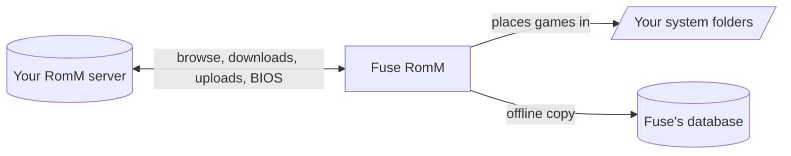

- **Pairing without a password where it can.** On a RomM server that offers it, Fuse asks to be
  approved as a device, or takes a pairing code made in RomM, and keeps a read-only or
  upload-capable token you can revoke in RomM. A server without client tokens takes a sign-in.
  Either way it lives only in Fuse's secure secret storage, never in the database, logs,
  screenshots, diagnostics or exported settings.
- **Home and away.** A local address, an outside one, or both: Fuse uses whichever answers and
  never waits on one that doesn't.
- **What the server can do, from the server.** Fuse reads RomM's own API description, so features
  a server lacks are simply not offered.
- **An offline copy.** The server's library is kept in Fuse's database, brought up to date a page
  at a time, so the Fuse RomM tab, its systems and collections, and Search work without the server.
- **Games in the folders you have.** Downloads go through Downloads into the system folders Fuse
  already uses, resumed where they stopped and checked before they are put in place. A RomM game
  is matched to one in your library only by its RomM link, a hash, the console's own title id, the
  exact file name, or the same name with the same region and revision when it is the only one on
  each side; a name that only looks alike never joins two games.
- **Uploads** in pieces, resumed where they stopped, with a token that allows them.
- **BIOS from RomM** on health pages and each system's BIOS menu. A file you already have is never
  replaced by one of the same name; firmware an emulator installs itself goes to a Firmware folder
  with how to install it.

Fuse RomM and Cartridge are both supported. Turning one on turns the other off in Fuse, keeping
both set up, so you can switch back at any time.

## RomM through Cartridge

<a href="docs/assets/screenshots/cartridge.webp">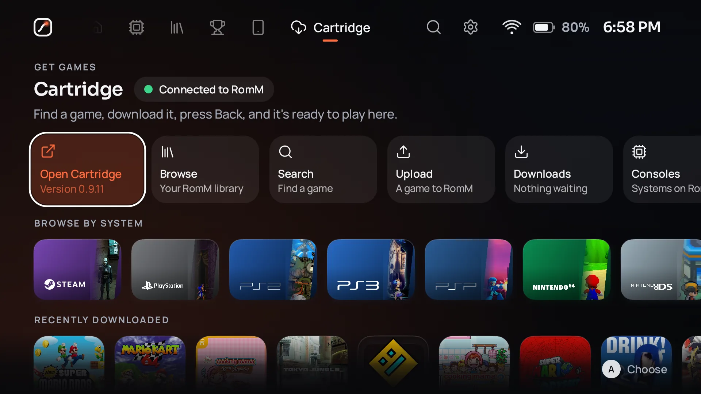</a>

Cartridge remains fully supported for people who prefer it to Fuse RomM. With Cartridge, Fuse
itself does not talk to RomM: [Cartridge](https://github.com/abdu2304/cartridge) by
[abdu2304](https://github.com/abdu2304), a RomM companion app, signs in to your RomM server, keeps
the credentials, and downloads games into folders on your device. Fuse scans those folders like any other and reads Cartridge's local status to show
what it is doing.

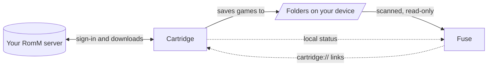

To pair them:

1. Install Cartridge 0.9.10 or newer (Settings, Accounts, Cartridge in Fuse can install it from Cartridge's
   GitHub releases after you confirm). RomM's details, each game's download progress and uploading
   games to RomM need Cartridge 0.9.11 "The Bridge Expansion", with bridge protocols 2 and 3 (in
   review as [MAtiyaaa/cartridge#30](https://github.com/MAtiyaaa/cartridge/pull/30)).
2. Sign in to RomM inside Cartridge and download some games.
3. In Fuse, add the folder Cartridge saves to as a library, if setup did not suggest it already.

On Android, Fuse reads Cartridge's status through a read-only content provider protected by a
Cartridge permission; on Linux it reads `~/.local/state/cartridge/status.json`
(`$XDG_STATE_HOME/cartridge/status.json`). Fuse opens Cartridge on a specific page, platform or game
with `cartridge://` links. It can also hand Cartridge a game to upload to your RomM server ("Upload
to RomM" in a game's options): Cartridge shows the files and uploads only after you confirm there.
**No server address, token or password ever passes between the two apps.**
The full protocol is in [INTEGRATIONS.md](INTEGRATIONS.md#cartridge-bridge-protocol).

## Build it yourself

You need JDK 17 or newer and, for Android, the Android SDK with API level 37 installed.

```sh
./gradlew :app:android:assembleDebug   # Android debug APK
./gradlew :app:desktop:run             # run the desktop app
./gradlew allTests                     # every test
```

[BUILDING.md](BUILDING.md) covers tests per module, the AppImage and release signing.

## Privacy

Fuse contains **no telemetry, analytics, advertising or crash reporting**, and your library works
fully offline. Fuse only contacts a service after you set it up: your own Fuse Sync host, your own Syncthing, your own Jellyfin server,
RetroAchievements, SteamGridDB, IGDB, TheGamesDB, ScreenScraper and libretro thumbnails receive only what they need to answer (for example a
game's title, or your own API key). The one service used without setup is GitHub, to check for new
versions of Fuse; you can turn automatic checks off in Settings, About, and nothing is ever
downloaded or installed without your confirmation. rpcs3.net is asked, with only a game's title id,
when you choose How It Runs in RPCS3. Backups and diagnostics reports are files you save yourself;
Fuse never sends them anywhere. API keys and passwords are kept in the system's
secure storage, never in logs or in the database. [INTEGRATIONS.md](INTEGRATIONS.md) lists exactly
what each service receives and when.

## Documentation

| Document | What it covers |
|---|---|
| [ARCHITECTURE.md](ARCHITECTURE.md) | Modules, domain model, scanning, launching, input, storage, security |
| [INTEGRATIONS.md](INTEGRATIONS.md) | Every online service and the Cartridge bridge, and what leaves the device |
| [DESIGN_SYSTEM.md](DESIGN_SYSTEM.md) | Tokens, type, focus, motion, themes, sound, accessibility |
| [docs/sync.md](docs/sync.md) | Fuse Sync by Fuse: hosting, profiles, what syncs, saves, conflicts, security, and Syncthing instead |
| [docs/player.md](docs/player.md) | Fuse Player by Fuse: engines, subtitles, controls, two screens |
| [docs/fuseline.md](docs/fuseline.md) | Fuseline by Fuse: curves, springs, transitions and how fast it is |
| [docs/jellyfin.md](docs/jellyfin.md) | Jellyfin in Fuse: connecting, home and away, what is sent |
| [docs/PHONE_LINK.md](docs/PHONE_LINK.md) | Phone Link: your phone as a window on the library, a keyboard and a controller |
| [docs/THEMES.md](docs/THEMES.md) | Writing, sharing and adding themes |
| [RESEARCH.md](RESEARCH.md) | What we learned about frontends, Android, emulators, RomM and scrapers |
| [ROADMAP.md](ROADMAP.md) | What is done and what comes next |
| [BUILDING.md](BUILDING.md) | Building, testing, packaging and signing |
| [CONTRIBUTING.md](CONTRIBUTING.md) | How to contribute |
| [CHANGELOG.md](CHANGELOG.md) | Release history |
| [THIRD_PARTY_NOTICES.md](THIRD_PARTY_NOTICES.md) | Licences of everything Fuse uses |

## Licence

Copyright (C) 2026 the Fuse contributors.

Fuse is free software: you can redistribute it and/or modify it under the terms of the GNU General
Public License as published by the Free Software Foundation, either version 3 of the License, or (at
your option) any later version (`GPL-3.0-or-later`). See [LICENSE](LICENSE). Fuse is distributed in
the hope that it will be useful, but without any warranty.

Third-party components keep their own licences; see [THIRD_PARTY_NOTICES.md](THIRD_PARTY_NOTICES.md).

## Credits

- **Fuse Sync by Fuse**, **Fuse Player by Fuse** and **Fuseline by Fuse**, Fuse's own sync,
  media player and animation engine, written for Fuse and part of this repository, under its licence.
- [ES-DE](https://es-de.org/), whose MIT-licensed emulator configuration is the best public record of
  how emulators accept games.
- [RomM](https://github.com/rommapp/romm), whose folder conventions, platform names and alias table Fuse follows.
- **[Cartridge](https://github.com/abdu2304/cartridge) by [abdu2304](https://github.com/abdu2304)**
  (MIT), the RomM companion Fuse pairs with, and where Fuse learned to match emulator forks by name
  and to know an AppImage by what it updates from.
  Fuse's bridge (live downloads, deep links and uploads) is being contributed to Cartridge; until
  it is merged there, Fuse installs Cartridge from the [MAtiyaaa/cartridge](https://github.com/MAtiyaaa/cartridge)
  fork, and will switch to abdu2304's releases once it is.
- [Jellyfin](https://jellyfin.org/), the free media server Fuse plays your films, shows and music
  from, and [FFmpeg](https://ffmpeg.org/) (through [JavaCPP](https://github.com/bytedeco/javacpp-presets))
  and [Media3](https://developer.android.com/media/media3), which Fuse Player by Fuse decodes with.
- [rcheevos](https://github.com/RetroAchievements/rcheevos) and
  [RetroAchievements](https://retroachievements.org/).
- **Music by boipurple.** Fuse's menu music is boipurple's albums *jam channel* and *creature
  interchange*: puddleworld plays under the menus and alright apothecary during setup, and every
  song can be picked in Settings, Sound, shuffled, or skipped from the quick menu. The songs remain the artist's own and are not covered by Fuse's
  licence.
- [Lucide](https://lucide.dev/) icons (ISC), and the [Sora](https://github.com/sora-xor/sora-font) and
  [Manrope](https://github.com/googlefonts/manrope) typefaces (SIL Open Font License).
- Kotlin, Compose Multiplatform, SQLDelight, Ktor, Coil and kotlinx libraries.
- The emulator and launcher developers whose work Fuse starts.

<sub>iiSU was studied as a reference for quality only; no code or assets were taken from it, nor from
Sony, Microsoft or Nintendo. Console and game names are trademarks of their owners and are used only
to identify systems. Fuse ships no console artwork, console sounds, BIOS files or games.</sub>

<br>

<div align="center">
<picture>
  <source media="(prefers-color-scheme: dark)" srcset="docs/assets/brand/mark-dark.svg">
  
</picture>
<br>
<sub>Fuse is free software, made in spare time for everyone who plays with a controller.</sub>
</div>
