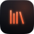
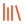
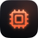
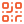

# Feature icons

Icons for the README's feature grid. They are the same Lucide line icons the app draws (the path data
is read from `FuseIcons.kt`), in the Fuse accent, so the README and the interface speak one visual
language.

Two sets, both built by [`source/build.py`](source/build.py):

| Set | Size | Look | Backgrounds |
|---|---|---|---|
| `<name>.svg` | 48 x 48 | The icon in the accent (`#FF6A3D`, lit from above with the spark's `#FFB085`) with a soft glow, on an ink squircle tile with a warm room glow and a light top edge, like a focused tile in the app | One file for both GitHub themes: the tile carries its own background |
| `line/<name>.svg` | 24 x 24 | The bare line icon in `#F0582C`, the colour of the one-colour Fuse mark | Both themes: 3.4:1 contrast on `#ffffff`, 5.5:1 on `#0d1117` |

Tile colours are the Fuse theme preset (`ui/designsystem`, `theme/ThemePresets.kt`): `#1A1D25` fading
to `#07080B`. The corner is Fuse's continuous (squircle) corner, 0.235 of the side with smoothing 0.6, as
in the brand icon. Strokes are 1.8 on the 24 grid, the app's weight, with round caps and joins. No SVG
contains text, so nothing depends on fonts.

## The icons

| Badge | Line | File | Lucide icon | Concept |
|:---:|:---:|---|---|---|
|  |  | `controller` | `gamepad-2` | Controller |
|  |  | `home` | `house` | Home screen |
|  |  | `library` | `library` | Library |
|  |  | `folders` | `folder-search` | Game folders |
|  |  | `systems` | `cpu` | Systems and emulators |
|  |  | `launch` | `play` | Launch |
|  |  | `artwork` | `image` | Artwork |
|  |  | `achievements` | `trophy` | Achievements |
|  |  | `cartridge` | `cloud-download` | Cartridge and RomM |
|  |  | `second-screen` | `tablet-smartphone` | Second screen |
|  |  | `phone-link` | `qr-code` | Phone Link |
|  |  | `storage` | `hard-drive` | Storage |
|  |  | `collections` | `library-big` | Collections |
|  |  | `interface` | `sparkles` | Interface |
|  |  | `themes` | `palette` | Themes |
|  |  | `accessibility` | `accessibility` | Accessibility |
|  |  | `privacy` | `shield-check` | Privacy |
|  |  | `read-only` | `lock` | Read-only |
|  |  | `android` | `smartphone` | Android |
|  |  | `linux` | `monitor` | Linux desktop |
|  |  | `free-software` | `heart` | Free software |

The `android` and `linux` icons are a generic phone and a generic monitor, not platform logos.

## Using them

GitHub scales SVGs to the `width` and `height` you give the ``; the badges look best at 40 to 56
px, the line icons at 16 to 24 px. Next to a heading that already names the feature, the icon is
decorative, so give it an empty `alt`:

```html
<table>
  <tr>
    <td width="33%" valign="top">
      <br>
      <b>Built for controllers</b><br>
      <sub>Key repeat that speeds up while held, stick navigation and button hints.</sub>
    </td>
    <!-- two more cells -->
  </tr>
</table>
```

## Rebuilding

```sh
python3 docs/assets/icons/source/build.py
```

The script needs only the Python 3 standard library. To add an icon, add a row to `ICONS` in the
script; the name on the right must be one of the icons in `FuseIcons.kt` (to vendor a new Lucide icon,
add it to `tools/icons/generate_icons.py` first). `--preview DIR --png` writes a mock README grid and
renders it on both GitHub themes with Playwright (`--chromium PATH` picks the browser).

## Licence

The glyphs are [Lucide](https://lucide.dev) icons, Copyright (c) 2026 Lucide Icons and Contributors,
used under the ISC licence. `lock`, `monitor` and `smartphone` are among the icons Lucide derived from
[Feather](https://feathericons.com), Copyright (c) 2013-present Cole Bemis, which are also under the
MIT licence. Both licence texts are in
[`LICENSE-lucide.txt`](../../../ui/designsystem/src/commonMain/composeResources/files/licenses/LICENSE-lucide.txt).
The tiles, colours and build script are part of Fuse, under the GPL, version 3 or later.
